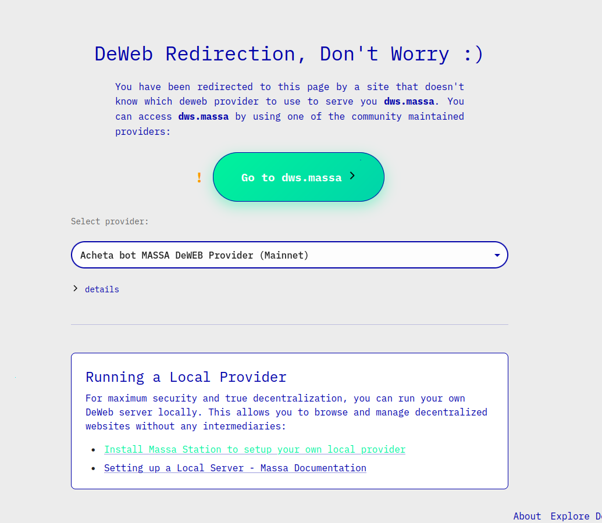

# Deweb Linking

## The Problem
In web2, you can link site A to another site B by displaying the URL of site B in site A.  
In web3, displaying a link to a decentralized website is not so straightforward.
A deweb website is identified by one (or several) MNS (Massa Name System) domain but you can't just display it inside a `<a>` balise because most browsers don't handle MNS.  
To access a deweb site, you have to incorporate its MNS as a subdomain of the URL of a [deweb provider](../../../deweb/provider/setup-public-instance.mdx). But which provider should you choose when you want to create a link to a deweb site ?  
The usual way is to hardcode the provider into a URL like this: `<mns>.<provider domain name>`
The drawback of this approach is that you force the user to use a specific provider. This causes the following issues:
- Add centralization
- If the provider is down, the link is dead
- If the user is running his own provider (see [here](../../../learn/decentralized-web.mdx) and [here](../../../deweb/local-server-config/setup-local-server.mdx)) they can't use it to access the linked site.


## Solution
### resolveDeweb function
Massa-web3 provides a function that abstracts provider selection logic:

```typescript
async function resolveDeweb(uri: string, chainId = CHAIN_ID.Mainnet): Promise<string>
```

- uri: The mns domain of the deweb site. Must be suffixed by ".massa" e.g., "dws.massa", "mip.massa"...
- chainId: Optional parameter to specify the network (mainnet, buildnet) on which the website is stored. Default: mainnet.
- Returns: A promise that resolves to an operational URL containing a provider and the mns URI as subdomain. If no providers have been found, return a fallback URL that redirects to a page allowing the user to choose a public provider. 

:::info
This function only works in a browser
:::

For example, if you want to put a link to [Syntra](https://syntra.massa.network/) (onchain token scheduling Dapp powered by [autonomous smart contracts](../../../learn/asc/intro.mdx)) decentralized website in your website, you can do something like that:
```html
<a href={resolveDeweb("syntra.massa")}>syntra.massa</a>
```

Under the hood, `resolveDeweb` function does the following:
- Checks if the current browser natively supports Massa name system. If so, it just returns the URI as passed in parameter:  
 "`http://<mns domain>.massa/<path and query params>`".  
For now, the only browser that supports MNS is [Decentr](https://decentr.net), on Windows OS only.
- If no native support, checks if the [deweb provider plugin](../../../learn/decentralized-web.mdx) of  [Massa Station](../../../massaStation/home.mdx) is running. If so, it will return  
"`http://<mns domain>.localhost:<deweb plugin port>/<path and query params>`".  
e.g. *"massexplo.massa/blocks"* -> *"http://massexplo.localhost:4242/blocks"* (the port is random)
- If no station deweb plugin is available, check if the user is running a [local deweb server](../../../deweb/local-server-config/setup-local-server.mdx). If so, return  
"`http://<mns domain>.localhost:8080/<path and query params`".  
e.g. *"adm.massa/options/nodes"* -> *"http://adm.localhost:8080/options/nodes"*
- If no local deweb server is running, check if the current website, the one displaying the link, is served to the user by a deweb provider. If the website the user is currently visiting is a decentralized one, it means that it is served to him via a deweb provider. So we can use the same provider the user is currently using to serve the deweb website in the link. The function will thus return  
"`http://<mns domain>.<current provider domain>/<path and query params>`".  
e.g. *"compound.massa/lend"* -> *"http://compound.massa.network/lend"*
- If none of the previous providers are available, return a fallback URL : 
```
https://deweb.massa.network/deweb_redirect?chain_id=<chain id>&deweb_url=<mns domain>
```

This fallback URL has two query parameters:
- *chain_id*: the chain id used in the `resolveDeweb` function
- *deweb_url*: the URI passed as parameter to `resolveDeweb`


### redirection page
The redirection page targeted by the fallback URL is hosted on `deweb.massa` decentralized website.
The page helps the user to get a provider in two means:

- It allows the user to choose a public deweb provider among a community-maintained list. When the user clicks on the button, the deweb website required by the user is automatically opened in a new tab with the URL of the selected provider.
- The page also suggests the user to access the deweb site by using their own deweb provider. The user is invited to download one of the following tools :
    - massa station deweb plugin
    - decentr browser if the current OS is Windows
    - run the provider server binary localy on the computer.



:::caution
Public providers proposed on the page are not checked. Ensure you trust the provider's admin.  
:::

### useResolveDeweb
`useResolveDeweb` is a react hook available in Massalabs [react ui kit](https://github.com/massalabs/ui-kit) react tool kit. It's a wrapper around `resolveDeweb` function.

```ts
function useResolveDeweb(Url: string, chainId?: bigint): {resolvedUrl: string, isLoading: boolean, error: string | null}
```

Parameters:
- Url: the URL of the deweb site. The URL can be a mns domain with a deweb provider domain. The ".massa" suffix after the mns domain is not required, but the protocol prefix ("http://") does.
- chainId: Same as for `resolveDeweb`

Result:
- resolvedUrl: the result returned by `resolveDeweb` 
- isLoading: Whether the URL creation process is pending or not
- error: eventual error of the process.