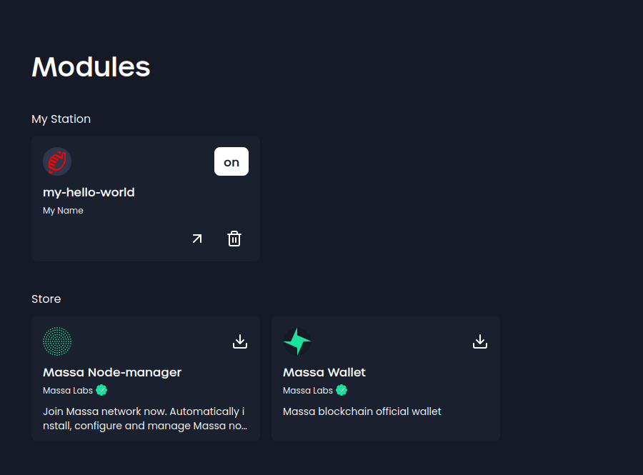

# Part 1: Create a basic plugin

This part will show you how to create a basic plugin that simply displays a message.

## Define your plugin

- Define an API for the plugin that will allow MassaStation to interact with it.
  - Set up the api folder: create `api/server`
  - Create a file named `swagger.yml` in the api folder
  - Initialize it with basic information

```yaml
consumes:
  - application/json
info:
  description: Hello world plugin API.
  title: station-massa - Hello world
  version: 0.0.0
produces:
  - application/json
schemes:
  - http
swagger: "2.0"
paths:
  /:
    get:
      operationId: defaultPage
      responses:
        "301":
          description: Move to the default endpoint
```

:::info

Here we simply defined a default endpoint that will be called when the plugin is called without any endpoint specified.

:::

:::tip

For a detailed understanding of the API specification and how to edit it, refer to the [official OpenAPI Specification documentation](https://www.openapis.org/).

:::

- Create a `generate.go` file: in the root of your project
  :::tip
  this file will generate the API from the swagger file when you run `task generate`
  :::
- Add the following code to it:

  ```go
  package main

  //go:generate swagger generate server --quiet --target api/server --name station-massa-hello-world --spec api/swagger.yml --exclude-main
  ```

- Run `go generate ./...` to generate the API


## Implement your plugin

```go
package main

import (
	"github.com/go-openapi/loads"
	"github.com/my-username/station-massa-hello-world/api/server/restapi"
	"github.com/my-username/station-massa-hello-world/api/server/restapi/operations"
)

func initializeAPI() *restapi.Server {
	swaggerSpec, err := loads.Analyzed(restapi.SwaggerJSON, "")
	if err != nil {
		panic(err)
	}

	pluginAPI := operations.NewHelloWorldAPI(swaggerSpec)
	server := restapi.NewServer(pluginAPI)

	server.ConfigureAPI()

	return server
}
```

- set up the cors: the cors will allow the plugin to be called from the massastation server

```go
func setupGlobalMiddleware(handler http.Handler) http.Handler {
	handleCORS := cors.New(cors.Options{}).Handler

	return handleCORS(handler)
}
```

- Add the `main` function in `station-massa-hello-world.go`: it initializes the API and start the server

```go
func main() {
	intSig := make(chan os.Signal, 1) // creates a channel to receive the interrupt signal
	signal.Notify(intSig, syscall.SIGINT, syscall.SIGTERM) // notifies the channel when the interrupt signal is received

	server := initializeAPI() // initializes the API

	if err := server.Serve(); err != nil {
		panic(err)
	}

	<-intSig // waits for the interrupt signal to be received
}
```

- Run the API on a local server to test and validate its functionality.

```bash
go run ./station-massa-hello-world.go
```

- You should get the following output:

```bash
2023/07/24 16:02:51 Serving hello world at http://[::]:41701
Tic!
```

:::tip
The last numbers correspond to the port the API is running on. It will change each time you will restart the plugin.
:::

## Deploy on massastation

### Register the plugin

To do so,
Import the plugin package. `github.com/massalabs/station-massa-hello-world/pkg/plugin`

- Listen to the server created and register the plugin with the `RegisterPlugin` function from the plugin package.

```go
	listener, err := server.HTTPListener()
	if err != nil {
		panic(err)
	}

	plugin.RegisterPlugin(listener,plugin.Info{})
```

### Install the plugin

Move the plugin binary, the manifest and the swagger file to the massastation plugin folder.

:::tip

On linux or macOS you can use the following command to move the files:

```bash
mkdir -p /usr/local/share/massastation/plugins/station-massa-hello-world
cp build/station-massa-hello-world/station-massa-hello-world /usr/local/share/massastation/plugins/station-massa-hello-world
cp web/content/hello_world.svg /usr/local/share/massastation/plugins/station-massa-hello-world
cp manifest.json /usr/local/share/massastation/plugins/station-massa-hello-world
```

On Windows, you can use the following command in the PowerShell:

```powershell
# Create the directory
$destinationDir = "C:\Program Files (x86)\MassaStation\plugins\station-massa-hello-world"
New-Item -ItemType Directory -Force -Path $destinationDir

# Copy the files
$sourceDir = "build\station-massa-hello-world"
Copy-Item $sourceDir\station-massa-hello-world $destinationDir -Force

$sourceDir = "web\content"
Copy-Item $sourceDir\hello_world.svg $destinationDir -Force

Copy-Item manifest.json $destinationDir -Force
```

:::

Run Massa Station. `massastation`

**You should see** :

- the plugin in the plugin list on [the module page](https://station.massa/web/store)
  
- the 'Tic' message in the console
