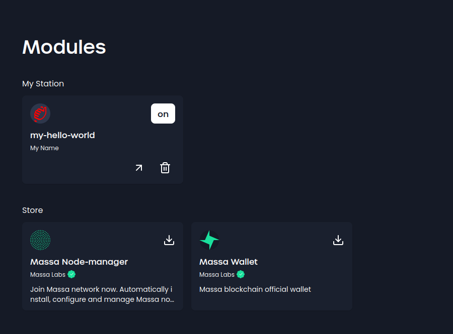

# Creating a module : step by step

Let’s take the “Hello world” plugin located [here](https://github.com/massalabs/station-massa-hello-world/tree/main) and use it as an example.

## Creating the module

You can create a plugin either in go, and use our tailor made package, or do your own, following the requirements

### Create your go plugin

#### Initialize your go project :

initialize the go module :

```bash
go mod init github.com/my-username/my-hello-world
```

Install the hello-world package, we will need it later

```bash
go get github.com/massalabs/station-massa-hello-world
```

- Now, you need a logo.
  - run `mkdir -p web/content && touch web/content/my-hello-world.svg` to create the file
  - add your custom logo or copy paste this one:

```svg
<?xml version="1.0" encoding="UTF-8"?>
<svg id="Calque_2" data-name="Calque 2" xmlns="http://www.w3.org/2000/svg" xmlns:xlink="http://www.w3.org/1999/xlink" viewBox="0 0 814.29 995.14"  width="40" height="40">
  <defs>
    <style>
      .cls-1 {
        isolation: isolate;
      }

      .cls-2 {
        clip-path: url(#clippath);
      }

      .cls-3 {
        fill: none;
      }

      .cls-4 {
        fill: red;
      }
    </style>
    <clipPath id="clippath">
      <polygon class="cls-3" points="121.18 995.14 82.61 352.54 693.24 0 731.81 642.59 121.18 995.14"/>
    </clipPath>
  </defs>
  <g id="Calque_1-2" data-name="Calque 1">
    <g class="cls-1">
      <g class="cls-2">
        <path class="cls-4" d="m309.34,249.71c-1.87,1.08-3.75,2.25-5.63,3.49-20.25,13.49-38.19,35.32-49.2,59.9-1.46,3.28-2.53,6.56-3.67,9.82-13.15-3.54-28.99-.72-45.19,8.64-1.74,1-3.48,2.08-5.22,3.24-20.28,13.49-38.22,35.34-49.22,59.92-9.96,22.25-12.13,44.04-7.75,61.18-13.94,12.95-25.94,29.63-34.11,47.89-17.9,39.95-11.48,78.96,14.9,90.74l9.31,4.16c-8.44,10.25-15.72,21.9-21.25,34.23-17.85,39.95-11.42,78.93,14.66,90.6l182.2,86.46c46.37,21.99,105.74,15,168.21-20.5,61.63-35.58,120.76-95.78,161.8-166.83l19.44-33.66c40.28-69.74,61.2-146.29,57.37-210.04l-9.91-165.14c-1.42-23.62-12.55-40.26-30.57-45.68-14.65-4.42-32.64-.91-50.77,9.56-4.13,2.38-8.27,5.13-12.38,8.23-35.97,27.2-61.23,78.29-58.79,118.91l1.51,25.14-195.27-87.21c-13.96-6.24-31.93-3.75-50.46,6.95m396.72-35.94v.06s0-.06,0-.06M136.87,819.9c-2.42,1.4-4.86,3.18-7.26,5.35-13.2,12.06-19.91,31.39-14.99,43.2,17.29,41.6,51.7,56.89,99.46,44.27,2.44-.66,4.85-1.66,7.22-3.03,11.02-6.36,20.71-19.8,23.24-33.36,3.09-16.47-5.54-26.87-19.27-23.26v-.02c-31.41,8.3-51.41-.66-62.85-28.23-4.03-9.68-14.6-11.24-25.55-4.92m287.66-357.59c6.52-3.76,12.88-10.15,17.52-18.23,9.32-16.21,8.31-33.14-2.27-37.86l-136.65-61.03c-7.68-3.43-10.07-14.27-5.43-24.65,4.13-9.26,10.13-14.21,13.32-16.33.46-.3.91-.58,1.37-.84,4.98-2.88,9.91-3.68,13.7-1.99l241.43,107.86c5.18,2.31,11.84,1.28,18.46-2.55,3.28-1.89,6.54-4.47,9.62-7.65,9.24-9.63,14.86-22.99,14.22-33.8l-5.39-89.8c-.86-14.4,7.6-32.59,19.24-41.39,1.44-1.08,2.88-2.03,4.31-2.86,6.12-3.53,12.04-4.71,16.99-3.23,6.04,1.78,9.74,7.34,10.21,15.21l9.92,165.23c2.98,49.59-13.27,109.11-44.61,163.36l-19.43,33.66c-32.37,55.98-77.75,102.12-125.61,129.75-.1.06-.19.11-.29.17-48.78,27.69-95.56,33.48-131.74,16.31l-182.44-86.63c-7.71-3.41-10.1-14.25-5.45-24.64,4.15-9.27,10.15-14.22,13.34-16.34.48-.31.95-.61,1.43-.88,4.97-2.87,9.89-3.63,13.65-1.95l105.27,47.02c5.29,2.36,11.95,1.22,18.46-2.53,6.51-3.76,12.86-10.13,17.52-18.24,9.32-16.21,8.31-33.14-2.27-37.86l-164.95-73.67c-7.68-3.46-10.07-14.27-5.43-24.65,4.16-9.3,10.15-14.25,13.34-16.37.49-.33.99-.64,1.5-.93,4.79-2.76,9.83-3.54,13.55-1.88l166.73,74.47c5.27,2.36,11.95,1.22,18.47-2.54,6.51-3.76,12.87-10.15,17.52-18.23,9.32-16.21,8.31-33.14-2.27-37.86l-181.53-81.07c-7.68-3.46-10.07-14.27-5.43-24.65,4.13-9.26,10.13-14.22,13.32-16.34.51-.34,1.01-.65,1.51-.94,5.02-2.9,9.82-3.55,13.56-1.89l183.28,81.84c5.27,2.36,11.95,1.22,18.46-2.54m14.28-315.41c-11,6.35-20.74,19.8-23.31,33.38h.03c-3.09,16.47,5.54,26.89,19.27,23.26,31.41-8.3,51.38.67,62.85,28.23,4.03,9.64,14.58,11.28,25.5,4.97,2.44-1.41,4.91-3.23,7.31-5.41,13.18-12.04,19.92-31.39,15-43.21-17.32-41.58-51.7-56.88-99.47-44.27-2.41.64-4.83,1.67-7.18,3.03"/>
      </g>
    </g>
  </g>
</svg>
```

- Now let's create the manifest file :
  - run `nano manifest.json`
  - paste the following content, you can change the values with your own :

```json
{
  "author": "My Name",
  "name": "my-hello-world",
  "description": "hello world plugin",
  "logo": "hello_world.svg",
  "home": "",
  "version": "0.0.6",
  "apispec": ""
}
```

- set up the Task file :
  - run `nano Taskfile.yml`
  - paste the content of the following [file](https://github.com/massalabs/station-massa-hello-world/blob/main/Taskfile.yml)

#### Define your plugin

- Define an API for the plugin that will allow MassaStation to interact with it. You can use frameworks like Swagger or Gin to facilitate API development, or choose other suitable frameworks as per your preference.
  - create a file named `swagger.yml` : `touch api/swagger.yml`
  - Initialize it with the different endpoints you want to expose, for example :

```yaml
consumes:
  - application/json
info:
  description: Hello world plugin API.
  title: station-massa - Hello world
  version: 0.0.0
produces:
  - application/json
schemes:
  - http
swagger: "2.0"
paths:
  /:
    get:
      operationId: defaultPage
      responses:
        "301":
          description: Move to the default endpoint
  /api/hello:
    put:
      operationId: hello
      parameters:
        - in: query
          name: name
          type: string
          description: the name of the person to be greeted.
      produces:
        - application/json
      responses:
        "200":
          description: Greeting content.
          schema:
            type: object
            required:
              - message
            properties:
              message:
                description: Greeting message.
                type: string
                x-nullable: false
        "500":
          description: Internal Server Error - The server has encountered a situation it does not know how to handle.
```

> Here we have defined two endpoints :
>
> - `/` : the default endpoint, that will redirect to the default endpoint
> - `/api/hello` : the endpoint that will greet the user

#### Implement your plugin

- create a `generate.go` file : `touch generate.go`
- add the following code to it :

```go
package main

//go:generate swagger generate server --quiet --target api/server --name hello-world --spec api/swagger.yml --exclude-main
```

> This will generate a `cmd/hello-world-server/my-hello-world.go` file, that will be the entry point of your plugin

- Implement the necessary endpoints and functionality in your API.
  run `touch api/endpoints.go` and implement the endpoints you defined in the swagger file :

```go
package api

import (
	"fmt"

	"github.com/go-openapi/runtime/middleware"
	"github.com/your-username/hello-world/api/server/restapi/operations"
)

func Hello(params operations.HelloParams) middleware.Responder {
	target := "World"
	if params.Name != nil {
		target = *params.Name
	}

	return operations.NewHelloOK().WithPayload(
		&operations.HelloOKBody{Message: fmt.Sprintf("Hello, %s!", target)},
	)
}

func Goodbye(params operations.GoodbyeParams) middleware.Responder {
	target := "World"
	if params.Name != nil {
		target = *params.Name
	}

	return operations.NewGoodbyeOK().WithPayload(
		&operations.GoodbyeOKBody{Message: fmt.Sprintf("Goodbye, %s!", target)},
	)
}
```

> Here we have implemented the two endpoints we defined in the swagger file

- set the handler for the endpoints
  - create a my-hello-world.go file in the root of your project : `touch my-hello-world.go`
  - create a `initializeAPI` function that will initialize the API with its handlers :

```go
package main

import (
	"github.com/go-openapi/loads"
	"github.com/your-username/hello-world/api/server/restapi"
	"github.com/your-username/hello-world/api/server/restapi/operations"
)

func initializeAPI() *restapi.Server {
	swaggerSpec, err := loads.Analyzed(restapi.SwaggerJSON, "")
	if err != nil {
		panic(err)
	}

	pluginAPI := operations.NewHelloWorldAPI(swaggerSpec)
	pluginAPI.HelloHandler = operations.HelloHandlerFunc(api.Hello)
	server := restapi.NewServer(pluginAPI)
	server.ConfigureAPI()

	return server
}
```

- set up the cors : the cors will allow the plugin to be called from the massastation server

```go
func setupGlobalMiddleware(handler http.Handler) http.Handler {
	handleCORS := cors.New(cors.Options{}).Handler

	return handleCORS(handler)
}
```

- in the `main` function, initialize the API and start the server :

```go
func main() {
	quit := make(chan bool)
	intSig := make(chan os.Signal, 1)
	signal.Notify(intSig, syscall.SIGINT, syscall.SIGTERM)

	go killTime(quit)

	server := initializeAPI()

	listener, err := server.HTTPListener()
	if err != nil {
		panic(err)
	}

	plugin.RegisterPlugin(listener)

	if err := server.Serve(); err != nil {
		panic(err)
	}

	<-intSig
	quit <- true
}
```

- Run the API on a local server to test and validate its functionality.
  - let's run the server : `go run my-hello-world.go`
  - you should see the following output :

```bash
2023/07/12 14:21:00 Serving hello world at http://[::]:37735
```

> The port will be different for you

- let's test the endpoints : on another tetminal, run the following commands :

  ```bash
  curl -X PUT "http://localhost:<port>/api/hello?name=John" -H  "accept: application/json"
  ```

> replace `<port>` with the port your plugin is running on

> you should see the following output :
>
> ```json
> { "message": "Hello, John!" }
> ```

- register your plugin on massastation
  - add the following package into the `my-hello-world.go` file : `github.com/massalabs/station-massa-hello-world`
  - add a server listener to your plugin & register it :

```go
    listener, err := server.HTTPListener()
    if err != nil {
    panic(err)
    }

    plugin.RegisterPlugin(listener, plugin.Info{})
```

- install your plugin on massastation
  - run `task install-plugin`
- let's try it out :
  - run MassaStation : click on the icon tray or run `massastation`
  - accesst the home page at `http://station.massa`
  - you should see the plugin in the list of plugins:
    
  - on another terminal, run

```bash
curl -X PUT "http://station.massa/plugin/my-name/my-hello-world/api/hello?name=John" -H  "accept: application/json"
```

- you should see the following output :

```json
{ "message": "Hello, John!" }
```

Congratulations! You have created your first plugin. You can now continue to add a web interface to your plugin.

#### Create a web app

To add a web-app to our plugin,

- we first need to add the right endpoint to the `swagger.yml`

```yaml
/web/{resource}:
  get:
    operationId: web
    produces:
      - application/json
      - text/javascript
      - text/html
      - text/css
      - text/webp
      - image/png
    parameters:
      - in: path
        name: resource
        type: string
        required: true
        description: Website resource.
    responses:
      "200":
        description: Page found
      "404":
        description: Resource not found.
```

- Run `task generate` to generate the new endpoints
- Then we create a basic html page :
  `nano web/content/index.html`
  ```html
  <html>
    <body>
      <h1>Hello, world!</h1>
    </body>
  </html>
  ```
- Still in the `web` folder, create `ressources.go` and `endpoints.go`.

  - `ressource.go` read the content of the html file and returns it :

  ```go
  package web

  import (
    "embed"
    "fmt"
  )

  const basePath = "content/"

  //go:embed content
  var content embed.FS

  func Content(resource string) ([]byte, error) {
    content, err := content.ReadFile(basePath + resource)
    if err != nil {
      return nil, fmt.Errorf("while reading %s in %s: %w", resource, basePath, err)
    }

    return content, nil
  }
  ```

- `endpoints.go` points massastation to the right ressource

  ```go
  package web

  import (
    "mime"
    "net/http"
    "path/filepath"

    "github.com/go-openapi/runtime/middleware"
    "github.com/massalabs/station-massa-hello-world/api/server/restapi/operations"
    "github.com/massalabs/station-massa-wallet/pkg/openapi"
  )

  // webHandle  handles a Web request.
  func Handle(params operations.WebParams) middleware.Responder {
    resourceName := params.Resource

    resourceContent, err := Content(resourceName)
    if err != nil {
      return operations.NewWebNotFound()
    }

    fileExtension := filepath.Ext(resourceName)

    mimeType := mime.TypeByExtension(fileExtension)

    header := map[string]string{"Content-Type": mimeType}

    return openapi.NewCustomResponder(resourceContent, header, http.StatusOK)
  }

  // defaultRedirectHandler redirects request to "/" URL to "web/index.html".
  func DefaultRedirectHandler(_ operations.DefaultPageParams) middleware.Responder {
    return openapi.NewCustomResponder(nil, map[string]string{"Location": "web/index.html"}, http.StatusPermanentRedirect)
  }
  ```

- Finaly we need to add the handler to the `initializeAPI` function :

  ```go

      ...

    pluginAPI.WebHandler = operations.WebHandlerFunc(web.Handle)
    pluginAPI.DefaultPageHandler = operations.DefaultPageHandlerFunc(web.DefaultRedirectHandler)

      ...
  ```

- Run again `task install-plugin` to install the new version of the plugin
- Navigate to `http://station.massa/plugin/my-name/my-hello-world/web/index.html` and you should access the html page you created.
