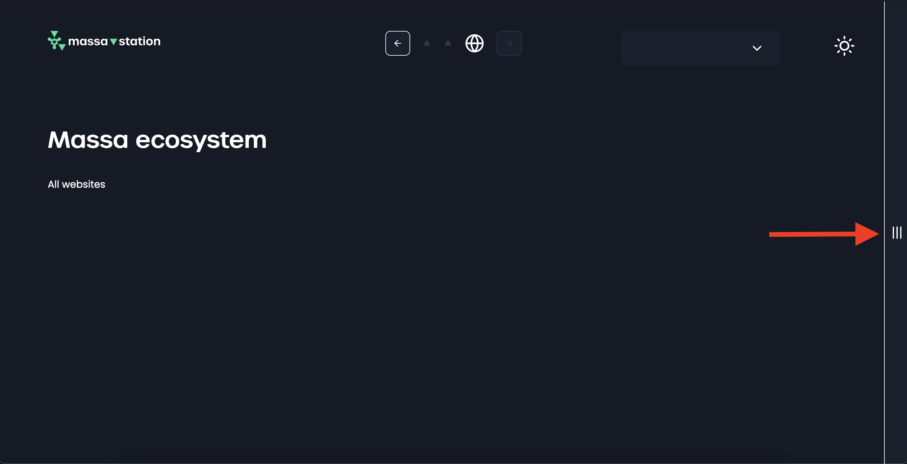
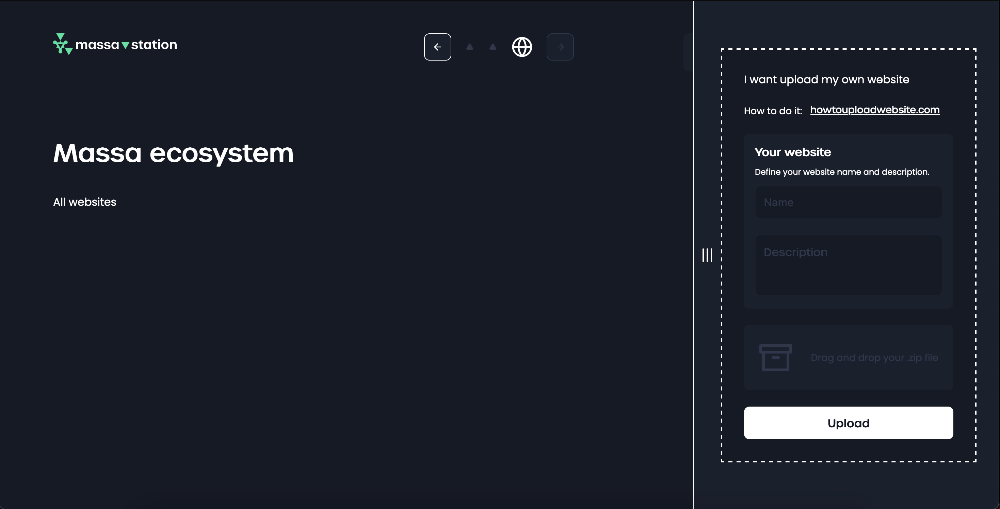

# How to upload a website

Massa Ecosystem allows users to participate, store, and navigate content on the Massa blockchain, among a lot of other things.

This guided is dedicated to getting you started with uploading a website on the blockchain using Massa Station.

Please note that we currently support static websites built with front end technologies like CSS, HTML & ES6 Javascript.

To get started, you need to download Massa Station [here](https://station.massa.net), and if needed follow the installation guide provided at this link: [Massa Station Installation Guide](https://github.com/massalabs/station/blob/main/INSTALLATION.md).

Once Massa Station is installed and launched, please install Massa Wallet using the home and [create an account](https://station.massa/plugin/massa-labs/massa-wallet/web-app/index).

Now that you have an account, you may proceed:

1. Open Massa Station and navigate to: [Massa Station Search Page](https://station.massa/web/search)
2. On the left side of the page, you will find a side panel that contains the steps to upload a website to the Massa blockchain.

Here's the information you need to provide:

1. Wallet: connect it using the drop-down menu
2. Name: A string that follows standard DNS rules, consisting of:
   - whole numbers (0-9),
   - lowercase letters (a-z),
   - underscores (\_),
   - dashes (-),
   - between 3 and 50 characters long.
3. Description: A string limited to 280 UTF-8 characters.
4. Zip file: A .zip file that contains a index.html file located at the root of the folder. The file must not exceed 1.5 Mo.

With each upload, there are associated costs to storing and hosting the files, you will be able to find more information in the official Massa Labs documentation located here: [Massa Storage Costs](https://docs.massa.net/en/latest/technical-doc/storage-costs.html). It will cost approximately 375 Massa coins for a website of 1.5 Mo.
