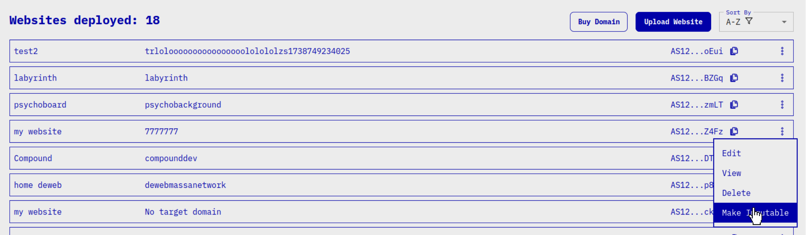
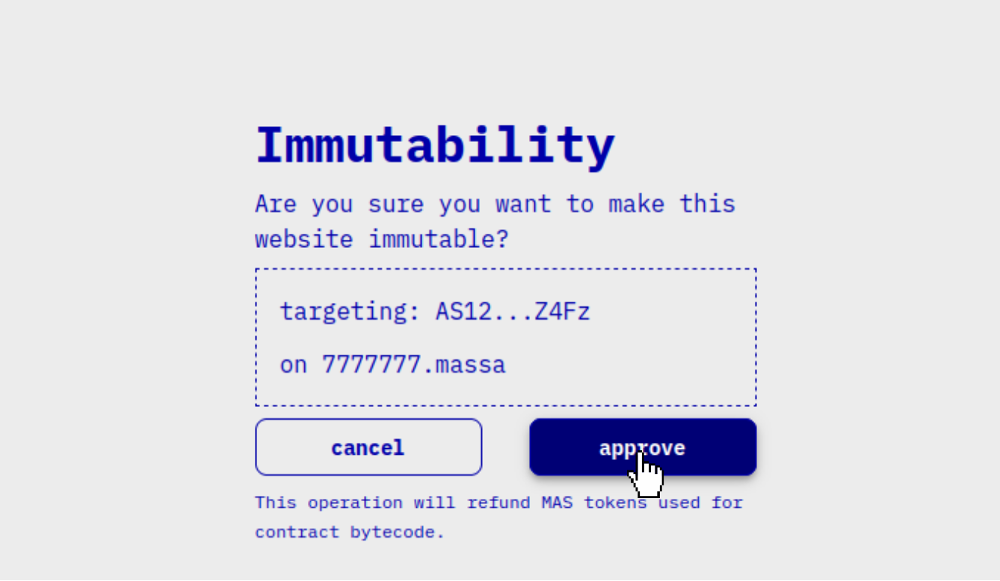
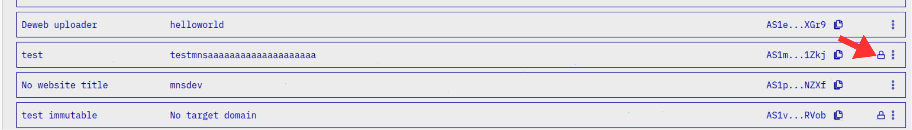

# Website Data Immutability

:::warning
Once you make a DeWeb website's data immutable, you will never be able to update this version of your website or delete it to recover tokens locked for storage.
:::

Achieving data immutability for a given DeWeb website is done by deleting the bytecode of the smart contract that handles that website.
That way, no person or piece of code can ever alter that data again.

## Make immutable with easy uploader

1. Go to [easy uploader](https://dws.massa.network) and connect your wallet.
2. Find the website you want to make immutable, click on the three-dot menu and select **Make Immutable**
    .
3. Review the data in the confirmation panel, click on **approve** and sign the operation on your wallet.
    

:::note
In the dashboard, websites mades immutable display a padlock icon.
    
:::


## Make immutable with the CLI

1. Set up the configuration of the cli if not already done. For more info, check [CLI Configuration](/docs/deweb/cli/config)
2. Type the following command:
    ```bash
    npx @massalabs/deweb-cli immutable <website_address>
    ```
3. Type `y` to accept the confirmation prompt.

:::info
To skip the confirmation prompt, you can add the `-y` or `--yes` option.
:::