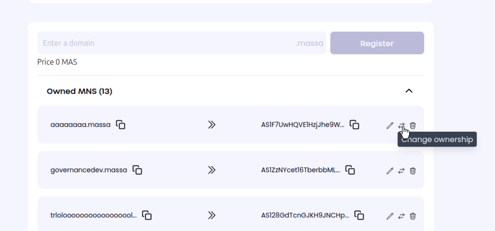
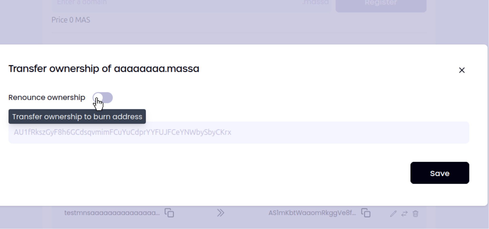

# MNS Domain Name Immutability

Making an MNS domain name immutable is achieved by changing its owner to a blank address.

To do so, go to https://mns.massa.network and connect your wallet.
Then, find the mns you want to make immutable and click on **Change Ownership** button.

Then, click on the **Renounce Ownership** toggle and click on save button.

Once the operation has been finalized on-chain, the MNS domain becomes immutable.

:::warning

After relinquishing ownership: * You **permanently lose** the ability to: * Modify the domain’s target * Transfer ownership to another address * Delete the domain to reclaim fee tokens :::
:::