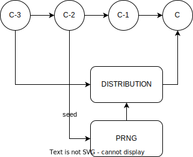
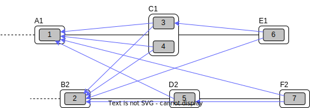
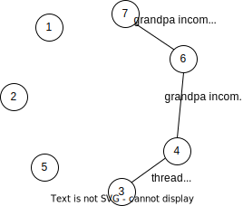

# Architecture of Massa node

The section describes the global architecture of a Massa node, from the ground up.

This is the diagram of the architecture of the software modules involved in building, endorsing and propagating blocks.
The bottom part corresponds to a single process running in a node and is in charge of the execution and consensus building.
The pool and factories, referred to as “factory”, can be potentially running in a different process or be part of the node.
Overall, each of the modules described here runs inside one or more threads attached to their respective executable process
(NB: the factory/node separation is not yet implemented, but will be soon).

We will explain below the different modules present in this diagram, and simulate the production of an operation to show
how it navigates through the different modules to better understand how blocks are produced and propagated.

## Bootstrap Module

The bootstrap module is responsible for the initial synchronization of the node with the rest of the network. It is responsible
for downloading the list of peers, the current graph of blocks, the ledger, the asynchronous pool, state of the Proof-of-Stake
and latests executed operations.

The bootstrap will be done from a server that is listed on the configuration of the node. Bootstrap is the entry point of the
network so you have to be careful on which node you connect to avoid downloading malicious data.

## API Module

The API Module is the public window of the node to the rest of the world. It allows for interactions with external clients or
factories via a [JSON RPC](/docs/build/api/jsonrpc) and [gRPC](/docs/build/api/grpc) protocols.

The API includes interfaces to do the following:

- publish a new operation from a client
- query the network about balances or ledger status
- allow for synchronization between remote pool/factory nodes and the consensus nodes, by sending/asking for blocks, best
  parents, draws, etc.

## Protocol/Network Module

The Protocol/Network Module implements the protocol connecting consensus nodes. This protocol is supported by a binary and optimized transport layer.

The Protocol/Network Module will relay all operations/blocks creation and propagation, so that all other nodes in the
network can synchronize their internal state, following a type of gossip synchronization protocol.

The type of messages that can be relayed via the Protocol/Network Module include:

- blocks/operations/endorsements propagation (either getting in or out of the node)
- nodes ban requests
- connectivity infos/stats.

## Selector Module, Proof of Stake sybil resistance

Every 0.5s, a new slot becomes active to receive a new block. A determinist selection mechanism ensures that one of
the nodes in the network is elected to have the responsibility to build the block for that slot. This mechanism must have several key properties:

- it should be sybil resistant, so that it is not possible to increase one’s odds of being elected by creating multiple
  clones of oneself (sybil) without a cost that is equal or greater than the cost of increasing one’s odds for oneself only;

- it should be deterministic, so that all nodes in the network will agree on the result of the selection at any given time;

- it should be fair, so that each participant has a well-defined probability of being selected somehow proportional to
  the cost of participating, and draws converge towards this probability distribution over time.

The way sybil resistance is achieved here is via the proof of stake mechanism. Nodes who want to participate in the block
creation lottery will have to stake “rolls” that they buy with Massa coins. If they try to cheat by creating fake blocks
or multiple blocks on the same slot, their stake will be taken away from them (slashing) and they would suffer the loss.
The probabilistic “surface” of a participant is equal to its total stake, which makes the creation of sybil accounts useless
because the stake would have to be split between them anyway.

:::note
More about slashing mechanism [here](/docs/learn/architecture/consensus-quality#slashing)
:::

The method used to draw an elected node for a given slot is simply a random draw from a distribution where addresses are
weighted by the amount of stake (=rolls) they hold. The schema below illustrates how the seed and probability distribution
are built, based on past cycles (two cycles are needed for the distribution update to ensure that the balance finalization
has occurred and the amount of rolls is accurate):

The Selector Module is in charge of computing the formula and replying to requests regarding what node is elected for any
given slot in the present or the past. The Execution Module (see below) is in charge of feeding the Selector Module with
updates regarding balances, needed to compute the draws.

## Graph/Consensus Module

The Consensus Module is the heart of the machinery of the Massa Network. It is in charge of integrating proposed blocks
into their respective slots and verifying the integrity of the result. We have not yet talked about the various constraints
regarding block creation, and in particular how parents are to be selected. In traditional blockchains, the parent of a
block is simply the previous valid block in the chain. In the context of the Massa network and the parallel chains in the
32 threads, identifying the proper parent in a given thread requires a more sophisticated strategy involving the notion of block cliques.

### Block cliques

At any given time, the set of all the blocks that have been produced and propagated in the network constitutes a graph (more precisely
a Directed Acyclic Graph or “DAG”), where each block, except the genesis blocks, has 32 parents. All the reasoning below can be in
principle done on this increasingly vast set, but in practice, we will introduce a notion of “finalized” or “staled” blocks, that
can be removed from the set and that will allow us to work on a smaller subset of recent blocks that are neither finalized nor
staled, so “pending” blocks. This set of pending blocks is all the network needs to know in order to incrementally build up a
consensus, therefore non-pending blocks will simply be forgotten (this is a striking difference with most other blockchains
that store in each node the history of all past transactions). The main benefit of this block pruning is to allow for some of
the algorithms below, which are in general NP-complete, to run fast enough on a smaller subgraph, and to allow for a practical implementation.

Here is a simplified example of a graph of pending blocks over two threads, with blocks 3 and 4 competing for slot C1 (for example
as a result of a multistaking attack where the block producer decided to create competing blocks for the same slot). Here the
letter of a slot identifies it, while the number refers to its thread number:

In this illustration we have shown only relevant parent links in blue, to make the whole diagram more readable, but in reality,
each block has 32 parents, one in each of the 32 threads.

An important notion we will use in the following is that of incompatibility between blocks. Excluding some edge cases with genesis
blocks, there are two sources of incompatibilities defined for blocks:

1. **thread incompatibility**: this occurs when two blocks in a given thread have the same parent in that thread.
2. **grandpa incompatibility**: this corresponds to a case with two blocks B1 and B2 in threads t1 and t2, and where the block
   B1 in t1 has a parent in t2 who is an ancestor of B2’s parent in t2, and symmetrically B2’s parent in t1 is an ancestor of
   B1’s parent in t1.

:::tip
You will find a more formal mathematical definition of these incompatibility notions in the [whitepaper](https://arxiv.org/pdf/1803.09029.pdf)
:::

From these definitions, you can build another graph, called the incompatibility graph, which connects any two blocks that
have any form of incompatibility together:

As you can see, some blocks are isolated and therefore compatible with any other, while some are linked, because they have
a form of incompatibility.

This brings us to the notion of a maximal clique which is a subset of the incompatibility graph such as none of the block
members are incompatible with each other (so, no internal link within the clique), and it is impossible to add an extra block
to the set without introducing incompatibilities. In the above example, there are three maximal cliques that can be built,
as illustrated below:

They represent candidates to extend the set of already finalized blocks into a coherent set of new blocks. All we need to
add to be able to build a consensus rule now is to introduce a deterministic metric to rank those candidates so that nodes
can independently and consistently decide on which clique is the best candidate and keep building on top of it. In particular,
once the best maximal clique is identified, it becomes trivial to define the list of the parents for a new block simply by
picking the oldest block from that clique in each thread.

The metric used in a traditional blockchain to rank competing chain candidates is habitually the length of the chain, or more
precisely the total amount of work invested in the chain (also known as “Nakamoto consensus”). In the case of block cliques,
we will introduce a notion of fitness for each block, and the fitness of the clique will simply be the sum of all its block’s
fitness. The block fitness $f(b)$ is simply defined as $1+e, e$ being the number of endorsements registered in the block.

Taking the maximal clique with the highest fitness (or some hash-based deterministic selection in case of equality), the
Graph/Consensus module can define what is called the blockclique at the current time.

### Finalized blocks, stale blocks

The set of pending blocks is growing each time a new block is produced and added to the current set. As we mentioned previously,
there is also a pruning mechanism in charge of reducing the size of the graph by removing blocks that are considered final, and
also blocks that can be considered stale and will never finalize.

If a block is only contained inside cliques that have a fitness lower than the fitness of the blockclique (the clique with the maximal fitness), minus a constant $\Delta_{f}^{0}$, then this block is considered stale. Also, any new block that includes in its parents a stale block is stale.

A block is considered final if it is part of all maximal cliques, and included in at least one clique where the total sum of the fitness of all its descendants is greater than $\Delta_{f}^{0}$.

$\Delta_{f}^{0}$ is defined as a constant $F$ multiplied by $1+E$
($E$ being the total max number of endorsements in a block, currently 16), and $F$ effectively measuring the maximum span in fully endorsed blocks of a successful blockclique, or the number of fully endorsed blocks by which an alternative clique can be shorter than the blockclique before its blocks may be discarded as stale.

### Graph/Consensus Module Function

The Consensus Module (formerly known as the Graph) receives new block proposals, integrates them into the set of pending blocks,
updating the blockclique with the method explained above, and verifying the legitimacy of the parenting of new blocks. It also
informs other modules, like the Execution module, when blocks are finalized and the corresponding ledger modifications implied
by their operations list should be made permanent.

It is also able to answer queries about the current best parents for a new block (based on the current blockclique) or the list
of current maximal cliques.

## Execution Module

The Execution Module is in charge of effectively executing the operations contained in blocks within the current blockclique,
which is provided by the Graph/Consensus Module. Operations will typically modify the ledger, either by changing the balances
of accounts or by modifying the datastore of smart contracts after the execution of some code. From an implementation point
of view, ledger modifications are however stored as diff vs the current finalized ledger, until the corresponding blocks are
marked as finalized by the Graph/Consensus Module.

Block creators will typically need to query the Execution Module to check current balances at a given slot and verify if some
operations can be run with sufficient funds or not, before being integrated into a new block.

As a side note, it is also possible that blocks might include invalid operations, in which case the Execution Module will
simply ignore them.

Being the maintainer of the ledger, the Execution Module is also queried about address information in general, via the API,
for any Module that needs it.

Finally, the Execution Module will inform the Selector Module when new cycles are initiated as the finalization of blocks
progresses.

## Pool Module

When new pending operations reach a node, they are not immediately processed but instead are stored in a pool of pending operations,
to be used by the Factory Module. Similarly, proposed endorsements coming from the Endorsement Factory are buffered inside the pool,
to be integrated into new blocks by the Block Factory Module.

The origin of pending operations or endorsements inside the pool can be internal to the factory process or could come from remote
nodes via the API Module. Similarly, locally produced pending endorsements are broadcasted via a gossip protocol to other pools
via the API Module.

Note that operations stored in the Pool are naturally discarded after a certain time, since operations come with an expiration
date in the _expiration_period_ field. Still, some potential attacks can occur by trying to flood the pool with high fees
operations that have no chance of being executed because the corresponding account does not have the required funds.
Discussing about countermeasure for this is beyond the scope of this introduction.

## Block/Endorsement Factory Module

The Block Factory Module is in charge of creating new blocks when the corresponding node address has been designated to
be the block creator for a given slot. This information is provided to the Factory Module from the Selector Module via
the API Module.

The Block Factory Module also needs information about the best parents (made of the latest blocks in each thread in
the blockclique) from the Graph/Consensus Module. These parents will be included in the newly created block. Balance
information, in order to assess the validity of pending operations, is obtained from the Execution Module, which
maintains the ledger state from the point of view of the slot where the new block is supposed to be created.

The Block Factory Module picks pending operations from the Pool Module. Note that the Block Factory will regularly
query the Execution Module about finalized and executed operations, and internally cleanup operations that have been handled.

Finally, the Block Factory will query the Pool Module and pick pending endorsements corresponding to the best parents
that are selected for the block.

With this information, it is able to forge a new block that will then be propagated to the Graph/Consensus Module
via the API Module, as well as to other nodes via gossip, to maintain a global synchronized state.

The Endorsement Factory Module works in a similar manner, requesting the Selector Module to find out when it has been
designated to be an endorsement producer, then feeding new endorsements to the Pool Module and the API Module for global synchronization.
