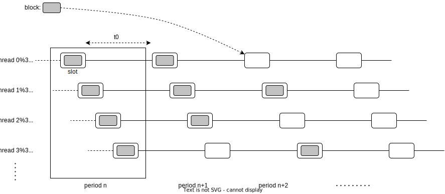
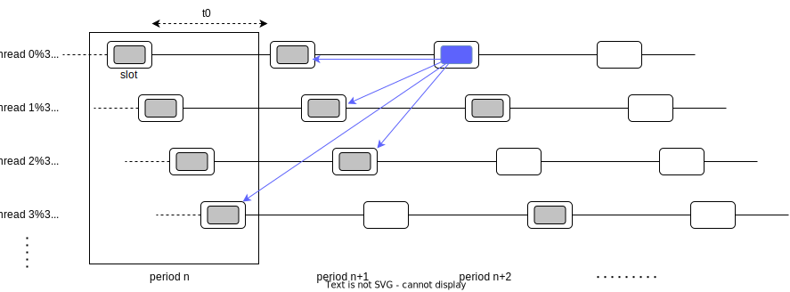

# Basic concepts

Let's dive into the basic definitions and concepts of Massa blockchain.

The goal of the Massa network is to build a consensus between **nodes** to gather 
and order **blocks** that contain ordered lists of **operations**. 
An operation ultimate purpose once executed is to act as transitions for the global network state, called the **ledger**.

Operations are produced by external clients and sent to the Massa network via a node. 
Some operations are containing code to be run as **smart contracts**, enabling complex programmatic 
modifications of the ledger. 
Nodes gather pending operations and group them into blocks. Each block has limited space to store operations. 
Traditional blockchains typically link blocks sequentially, including a hash of the previous block in the block 
header for temporal ordering. In contrast, Massa blocks are organized into a complex spatio-temporal structure, 
enabling parallelization and improved block-creation performance.

Instead of one chain, there are exactly 32 **threads** of chains running in parallel, with blocks equally 
spread on each thread over time, and stored inside **slots** that are spaced at fixed time intervals:

The time between two slots located on the same thread is called a **period** and lasts 16s (conventionally called $t_0$). 
Corresponding slots in threads are slightly shifted in time relative to one another, by one period divided by the number 
of threads, which is $16s/32 = 0.5s$, so that a period contains exactly 32 slots equally spaced over the 32 threads. 
A **cycle** is defined as the succession of 128 periods and so lasts a bit more than 34min. Periods are numbered by 
increments of one, so can be used together with a thread number to uniquely identify a block slot. Period 0 is the 
genesis and contains genesis blocks with no parents.

The job of the Massa nodes network is to essentially collectively fill up slots with valid blocks. To do so, 
at each interval of 0.5s, a specific node in the network is elected to be allowed to create a block (more about 
the selection process [here](/docs/learn/architecture#selector-module-proof-of-stake-sybil-resistance), and the proof of stake sybil resistance mechanism [here](/docs/learn/architecture#selector-module-proof-of-stake-sybil-resistance)),
 and will be rewarded if it creates a valid block in time. It is also possible that a node misses its opportunity 
 to create the block, in which case the slot will remain empty (this is called a **block miss**).

In traditional blockchains, blocks are simply referencing their unique parent, forming a chain. In the case of 
Massa, each block is referencing one parent block in each thread (so, 32 parents). Here is an example 
illustrated with one particular block:

Let’s introduce some relevant definitions and concepts generally necessary to understand how the Massa network operates. 
We will then explain the node architecture and how the whole system works.

## Ledger
The ledger is a map that stores a global mapping between addresses and information related to these addresses. 
It is replicated in each node. The consensus building mechanism ensures that agreement on what operations have 
been finalized (and in what order) will be reached over the whole network. The ledger is the state of the Massa network, 
and operations (see below) are requests to modify the ledger. 

The information stored in the ledger with each address is the following:

<table>
    <tr>
        <th colspan="2">Ledger Information Associated with Each Address</th>
    </tr>
    <tr>
        <td><code>balance</code></td>
        <td>The amount of Massa coins owned by the address</td>
    </tr>
    <tr>
        <td><code>bytecode</code></td>
        <td>When the address references a smart contract, this is the compiled code corresponding to the smart contract (typically contains several functions that act as API entry points for the smart contract)</td>
    </tr>
    <tr>
        <td><code>datastore</code></td>
        <td>A key/value map that can store any persistent data related to a smart contract, its variables, etc</td>
    </tr>
</table>

In order to promote widespread adoption and facilitate node running with reduced entry fees, the size of the ledger in Massa 
has been limited to a maximum of 1 TB. 
This decision sets Massa apart from other benchmark blockchain ledgers and makes it more accessible to users.

To achieve such a small ledger size, several technical decisions were made. 
Firstly, state changes that have been finalized and are found in the final Blocks no longer require record-keeping in the Ledger's memory. 
This optimization helps minimize the storage requirements for historical data, allowing the ledger to operate efficiently within the specified size limit.

In addition to this, Massa has introduced (Storage Costs)[todo link to page storage costs] as a novel approach to enhance storage efficiency. 
Users are now required to lock a certain amount of coins when they claim storage space. 
This innovative correlation between storage and circulating coins ensures a balanced utilization of resources. 
By implementing this mechanism, Massa optimizes storage utilization while maintaining the integrity and security of the ledger.

These technical decisions, including the exclusion of finalized state changes from ledger memory and the introduction of Storage 
Costs, play a crucial role in enabling the compact size of the ledger and ultimately facilitating a more efficient and accessible 
blockchain ecosystem.

## Address
An address on the Massa blockchain serves as your unique identity, granting you the ability to engage in various operations, 
store information, and exchange data with other participants. With an address, you gain access to a wide range of functionalities 
within the blockchain ecosystem.

Using your address, you can initiate operations that interact with the blockchain. 
This includes executing transactions, submitting smart contract calls, and engaging in other blockchain activities. 
Your address acts as the key to unlock these capabilities, allowing you to participate fully in the decentralized network.

Furthermore, your address enables you to store and retrieve information on the blockchain. Whether it's personal data, financial records, or any other form of digital information, you can securely store it using your address as the reference. This provides a reliable and immutable storage solution within the blockchain environment.

Importantly, your address also facilitates communication and data exchange with other participants on the blockchain. 
By sharing your address with others, you can interact, transact, and collaborate with different individuals and entities 
within the blockchain network. 
This seamless exchange of data and value promotes a decentralized and interconnected ecosystem.

Each user address on Massa has a public and private key associated with it. 
This is how messages can be signed and identity enforced.
The address of an account is simply the hash of its public key. 

Addresses are generated using a specific format that includes a prefix `A` and a base58 encoding. The prefix distinguishes between user addresses, linked to a KeyPair, and smart-contract addresses, denoted by the prefixes `U` or `S` respectively.

For user addresses (AU), the hash calculation involves taking the Blake3 hash of the byte representation of 
the user's public key. 
This process ensures a unique and secure identification for each user address within the system.

## Smart Contract
Smart contracts are a piece of code that can be run inside the Massa virtual machine, which can modify the ledger, 
and accept incoming requests through a public interface (via smart-contract operations). 

Smart contracts are currently written in AssemblyScript, a derivation from TypeScript, which is itself a 
type-safe version of JavaScript. AssemblyScript compiles to WebAssembly bytecode (wasm). Massa nodes Execution Module runs such bytecode. 
Smart contracts have access to their own datastore, so they can modify the ledger.

Smart contracts follow a different hash calculation than user addresses. It begins by constructing a byte array comprising various elements. 
This array consists of the slot represented in 5 bytes, with 4 bytes allocated for the period (encoded as a u64 in big endian 
format), 1 byte for the thread, and an index that increments for each address created within the same slot.
The index value is represented as a u64 in big endian format and is reset at the start of each new slot. 
Additionally, a single byte is appended to indicate whether the address is for real execution (1) or read-only execution (0).

The resulting byte array is then subject to the Blake3 hash function, generating a unique 
hash value that serves as the SC address.

**todo:**
- update the last paragraph to testnet 24 changes. 
- describe versioning for SC and how it works 
- describe functionality as above for User Addresses and draw differences in functionality (with clear examples)

### Autonomous Smart Contract Execution

One particularity of Massa smart contracts compared to other blockchain smart contracts is their ability to wake 
up by themselves independently of an exterior request on their interface. We call them Autonomous Smart Contracts (ASCs), 
as they allow more autonomy and less dependency on external centralized services.

ASCs offer a plethora of use cases that leverage their self wake-up functionality. 
In the realm of Decentralized Finance (DeFi), these contracts can automate liquidations, 
yield farming strategies, and portfolio rebalancing. 
Supply chain management benefits from autonomous contracts through automated inventory management and quality control processes. 
In the insurance industry, claims settlements can be accelerated with instant payments and parametric insurance. 
Gaming and NFT platforms can provide dynamic and interactive experiences with evolving NFTs and automated auctions. 
Additionally, real estate transactions can be streamlined with escrow automation and simplified rental agreements. 
These use cases exemplify the transformative potential of Autonomous Smart Contracts in enabling automated and efficient 
processes across various industries.

:::info
Learn more about Autonomous Smart Contracts [here](/docs/learn/asc/autonomous-smart-contract).
:::

## Storage costs

In Massa, each network node maintains a full copy of the ledger. Having a massive ledger size (hundreds of terabytes), would pose high entry barriers for potential node runners. To ensure smooth operation and enable node hosting at home, it's essential to establish a reasonable size limit, and remove the need for excessive storage capacity. After careful consideration, we have determined that a storage size limit of 1TB strikes the right balance. This means that each participant can store data on the ledger until it reaches the 1TB threshold. By implementing this limit, we aim to promote widespread adoption and empower individuals to run nodes effortlessly. 

In order to enforce this limit, users are required to lock a corresponding amount of coins for each byte of storage they claim. This applies to various data elements such as your address, balance, keys in your datastore, bytecode, and more. By locking coins, you establish a commitment that ensures fair usage of storage resources. Once you release your allocated space in the storage, the locked coins are subsequently released as well. This mechanism guarantees a balanced and accountable approach to managing storage within the network.

:::note
Read more about storage costs [here](/docs/learn/architecture/storage-costs).
:::

## Operation 
At its core, the Massa network revolves around the aggregation, sequencing, and execution of operations. Operations are 
recorded inside blocks that are located in slots. 

Operations are denoted by a string prefixed with 'O' that encapsulate crucial information within a byte array. 
The byte array encompasses the version in a u64 varint format, the Blake3 hash of the fully serialized content 
of the operation, and the public key of the creator. 
By meticulously organizing and recording operations within blocks that reside in specific slots, 
the Massa network ensures the integrity and efficiency of its operations.

### Operation types
There are three types of operations: transactions, roll operations, and smart contract code execution. 
The general structure of an operation is the following, and the different types of operations differ by their payload:

<table>
    <tr>
        <th colspan="2">Operation header</th>
    </tr>
    <tr>
        <td><code>creator_public_key</code></td>
        <td>The public key of the operation creator (32 bytes)</td>
    </tr>
    <tr>
        <td><code>expiration_period</code></td>
        <td>Period after which the operation is expired (u64 varint)</td>
    </tr>
    <tr>
        <td><code>fee</code></td>
        <td>The amount of fees the creator is willing to pay (u64 varint)</td>
    </tr>
    <tr>
        <td><code>type</code></td>
        <td>The type of operation (from 0 to 4: transaction, rollbuy, rollsell, executesc, callsc) (u64 varint)</td>
    </tr>
    <tr>
        <td><code>payload</code></td>
        <td>The content of the operation (see below)</td>
    </tr>
    <tr>
        <td><code>signature</code></td>
        <td>Signature of all the above with the private key of the operation creator (64 bytes)</td>
    </tr>   
</table>

#### Transaction operations
Transactions are operations that move native Massa coins between addresses. Here is the corresponding payload:

<table>
    <tr>
        <th colspan="2">Transaction payload</th>
    </tr>
    <tr>
        <td><code>amount</code></td>
        <td>The amount of coins to transfer (u64 varint)</td>
    </tr>
    <tr>
        <td><code>destination_address</code></td>
        <td>The address of the recipient (32 bytes)
    </td>
    </tr> 
</table>

#### Buy/Sell Rolls operations
Rolls are staking tokens that participants can buy or sell with native Massa coins. By owning rolls, 
addresses can participate in block creation  [more about staking below](/docs/node/stake). 
This is done via special operations, with a simple payload:

<table>
    <tr>
        <th colspan="2">Roll buy/sell payload</th>
    </tr>
    <tr>
        <td><code>nb_of_rolls</code></td>
        <td>The number of rolls to buy or to sell (u64 varint)
    </td>
    </tr>
</table>

#### Smart Contract operations
Smart Contracts are pieces of code that can be run inside the Massa virtual machine. There are two ways 
of calling for the execution of code; by direct execution of bytecode, and by a smart-contract function call. 
Former is done using the Execute SC operation, and latter with Call SC operation.

1. Execute SC operation
 
 The ExecuteSC operation provides a powerful functionality within the Massa network by enabling the execution of smart contracts 
 directly instead of storing them. 
 Instead of storing the bytecode, the code itself is placed within the operation as a smart contract. 
 When the ExecuteSC operation is executed, the blockchain triggers the execution of the main function within 
 the smart contract code. After the code is executed, the blockchain proceeds to other tasks while retaining 
 and reflecting the changes made to the ledger and other relevant data. 
 This approach ensures that the executed changes are recorded and maintained on the ledger, rather than 
 retaining the bytecode itself. 
 By executing smart contracts in this manner, the Massa network offers flexibility and efficiency 
 in managing and executing code within its blockchain ecosystem.

<table>
    <tr>
        <th colspan="2">Execute SC payload</th>
    </tr>
    <tr>
        <td><code>max_gas</code></td>
        <td>The maximum gas spendable for this operation (u64 varint)</td>
    </tr>
    <tr>
        <td><code>bytecode_len</code></td>
        <td>The length of the bytecode field (u64 varint)</td>
    </tr>
    <tr>
        <td><code>bytecode</code></td>
        <td>The bytecode to run (in the context of the caller address)</td>
    </tr>
    <tr>
        <td><code>datastore_len</code></td>
        <td>The number of the datastore keys (u64 varint), each record is then stored one after another</td>
    </tr>
    <tr>
        <td>list of datastore records</td>
        <td>Concatenation of <code>key_len</code> (u8), <code>key</code>, <code>value_len</code> (u64 varint), <code>value</code></td>
    </tr>
</table>

2. Call SC operation

Here, the code is indirectly called via the call to an existing smart contract function, together with the required parameters: 

<table>
    <tr>
        <th colspan="2">Call SC</th>
    </tr>
    <tr>
        <td><code>max_gas</code></td>
        <td>The maximum gas spendable for this operation (u64 varint)</td>
    </tr>
    <tr>
        <td><code>coins</code></td>
        <td>The coins transferred in the call (u64 varint)</td>
    </tr>
    <tr>
        <td><code>target_address</code></td>
        <td>The address of the targeted smart contract (32 bytes)</td>
    </tr>
    <tr>
        <td><code>function_name_length</code></td>
        <td>The length of the name of the function that is called (u8)</td>
    </tr>
    <tr>
        <td><code>function_name</code></td>
        <td>The name of the function that is called (utf8)</td>
    </tr>
    <tr>
        <td><code>param_len</code></td>
        <td>The number of parameters of the function call (u64 varint)</td>
    </tr>
    <tr>
        <td><code>params</code></td>
        <td>The parameters of the function call</td>
    </tr>
</table>

:::tip
- to do
:::

## Transaction fee
- to do

## Block
A block is a data structure built by nodes and its function is to aggregate several operations. As explained above, 
for each new slot that becomes active, a particular node in the network is elected in a deterministic way with the 
task of creating the block that will be stored in that slot (more about this in the description of the Selector 
Module below). A block from a given thread can only contain operations originating from a creator_public_key whose 
hash’s five first bits designate the corresponding thread, thus implicitly avoiding collisions in operations integrated into parallel threads. Block size is limited to 1 MB.

**to do**:
- explain in one paragraph the notion of finality of blocks and what they mean. 

The content of a block is as follows:

<table>
    <tr>
        <th colspan="2">Block header</th>
    </tr>
    <tr>
        <td><code>slot</code></td>
        <td>A description of the block slot, defined by a couple (period, thread) that uniquely identify it</td>
    </tr>
    <tr>
        <td><code>creator_public_key</code></td>
        <td>The public key of the block creator (32 bytes)</td>
    </tr>
    <tr>
        <td><code>parents</code></td>
        <td>A list of the 32 parents of the block, one parent per thread (parent blocks are identified by the block hash)</td>
    </tr>
    <tr>
        <td><code>endorsements</code></td>
        <td>A list of the 16 endorsements for the block (more about endorsements below)</td>
    </tr>
    <tr>
        <td><code>operations_hash</code></td>
        <td>A hash of all the operations included in the block (=hash of the block body below)</td>
    </tr>
    <tr>
        <td><code>signature</code></td>
        <td>Signature of all the above with the private key of the block creator</td>
    </tr>
    <tr>
        <th colspan="2">Block body</th>
    </tr>
    <tr>
        <td><code>operations</code></td>
        <td>The list of all operations included in the block</td>
    </tr>
</table>

### Endorsements
Endorsements are optional inclusion in the block, but their inclusion is incentivized for block creators. They are 
validations of the fact that the parent block on the thread of the block is the best parent that could have been 
chosen, done by other nodes that have also been deterministically selected via the proof of stake probability 
distribution (see below). A comprehensive description of endorsements can be found [here](/docs/learn/architecture/consensus-quality#endorsement), so we will 
not go further into details in the context of this introduction.

