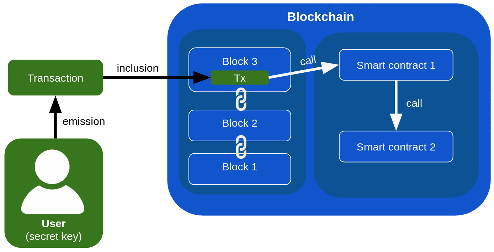
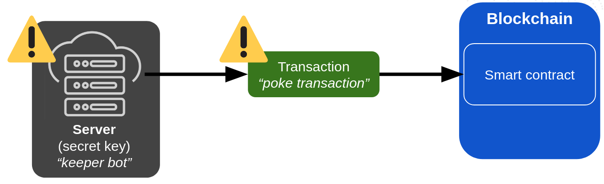
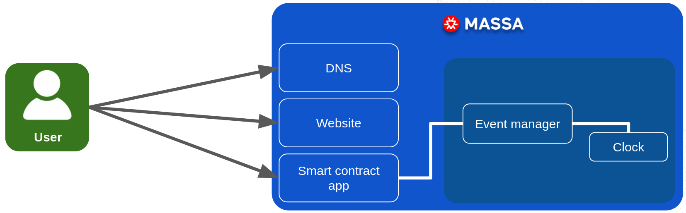
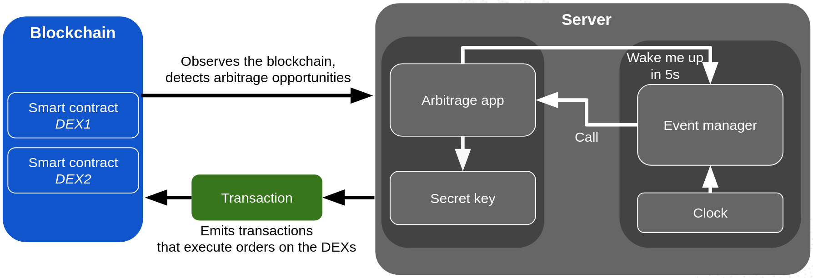
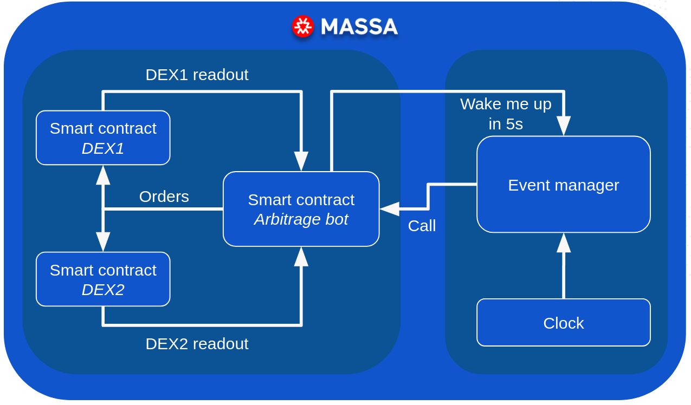

# Autonomous Smart Contracts

## The current state of automation in blockchains

In classical blockchain systems, smart contracts are only executed when triggered by transactions sent from the outside world by users or computers who own a private key.
See the picture below:

This means that dapps are typically **unable** to operate autonomously and do any of the following:
* decide to execute something at some time in the future (examples: closing an open position when it expires, scheduling a future action to happen even if the user is offline)
* wake up at regular intervals to refresh data (examples: send payments to an address every month, make NPCs evolve over time in a decentralized game)
* perform an action when something happens elsewhere on the blockchain (examples: trigger a liquidation whenever a position becomes under-collateralized, make a fully on-chain trading bot)

In other terms, dapp smart contracts are just sitting there, doing nothing and waiting for someone with a private key to call them from the outside.
But many use cases require smart contracts to be able to act autonomously, without any external trigger.
To respond to this common need, dapps typically rely on external services (keeper bots) that hold a private key and call their smart contracts at the right time,
which is a centralizing factor, an expense, and a potential point of failure.

When using keeper bots, the dapp is at risk:
* if the keeper bot is down when the execution is meant to happen, it won't happen,
* if the poke transactions are delayed or not included because of network congestion, the execution might be delayed or not happen at all,
* if the keeper bot is hacked and/or its private key stolen, the hacker can call the smart contract with malicious intent,
* if the keeper bot is delegated to a third party automation provider, the dapp is at the mercy of the practices and policy changes of the provider.

Also note that third party automation providers charge fees for their services, which can be a significant expense for dapps with a high volume of scheduled transactions.

## Massa's Autonomous Smart Contracts

### Overview

In Massa we strive for the only reason blockchain makes sense in the first place: decentralization.
Following that philosophy, we had to find a way to allow all smart contracts to function autonomously on-chain, without relying on external services.

This is why we have been the first to deploy the Autonomous Smart Contracts.
The Massa blockchain contains a scheduling system that allows smart contracts to schedule a future call to themselves or to other smart contracts.
The scheduling can be based on time, or on the occurrence of a specific on-chain event.

This means that Massa's smart contracts can:
* decide to execute something at some time in the future without relying on external services,
* wake up at regular intervals to refresh data autonomously,
* perform actions based on on-chain events without external triggers.

### A simple example to illustrate the concept

To illustrate the concept, let's consider a simple example: an arbitrage bot between two decentralized on-chain exchanges (DEXes).
Let's say the bot wakes up every 5 seconds, observes the same value pair on two DEXs and executes trades when the price difference between the two exchanges is high enough to make a profit.

#### Without Massa

Here is how it would be build in any other blockchain without autonomous smart contracts:

Basically, everything runs on a centralized server that owns a secret key to access liquidity on the DEXs,
and an internal timer of the server wakes up the bot at regular intervals to read the blockchain for price comparison and execute trades if needed by signing and emitting transactions.

Many things can go wrong with this approach (and many have gone wrong in the past):
* if the dapp creators are running the server themselves, it incurs an operational cost and a potential point of failure,
* if the team delegates automation to an external service, they need to give them the private keys and trust them with their liquidity,
* the server can be down when the bot is meant to wake up, missing opportunities,
* the network can be congested and the transactions can be delayed, which could cause the bot to miss the arbitrage opportunity or even act on outdated data and lose money,
* the transactions emitted by the server can be seen and front-run by other bots, which can make the bot lose money,
* the server can be hacked and the hacker can steal all the funds owned by its secret key on both DEXs.

#### With Massa

Here is how it would look like in Massa with Autonomous Smart Contracts:

Let's break it down:
* the arbitrage bot itself is a smart contract hosted on the Massa blockchain,
* when executed, the arbitrage bot smart contract does the following:
    1. it registers itself in the on-chain scheduler to be called again in 5 seconds,
    2. it reads the price of the same value pair on the two on-chain DEXs,
    3. if the price difference is high enough, it executes the orders on both DEXs,

The advantages of this approach are numerous:
* the bot does not rely on external services or servers:
    * no need to trust and pay for a third party automation provider,
    * the bot cannot be hacked, taken down and does not experience downtime,
    * no need to handle a private key to access the DEXs,
* the observation of both DEXs and the execution of both orders all happen **atomically**. This means that:
    * There is no slippage nor delays. Nothing else can execute or change between the observation of prices and the execution of the trades by the bot. In other words, the trades are executed with the exact prices observed.
    * No front-running is possible.

### Going further

Check out the [detailed description](./massa-asc) of Autonomous Smart Contracts to better understand how they work.
