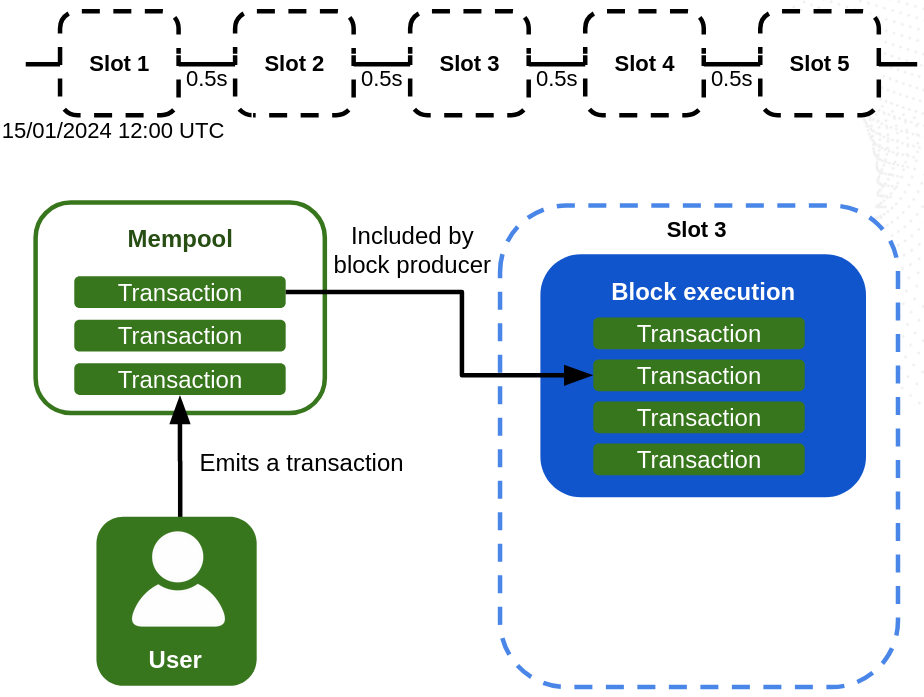
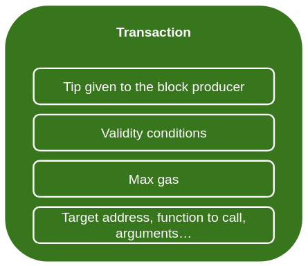
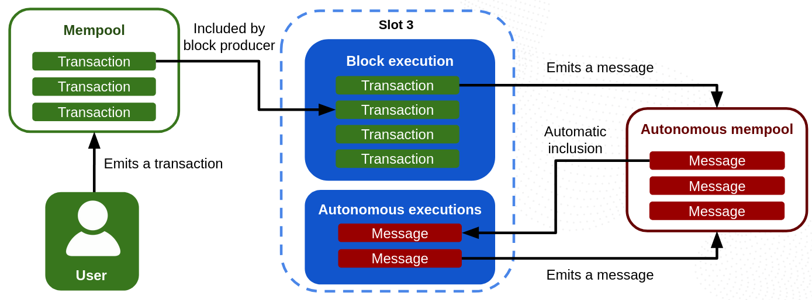
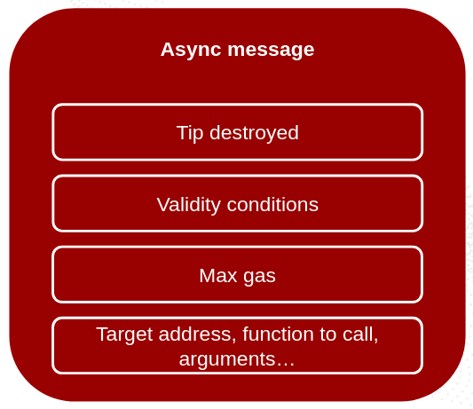
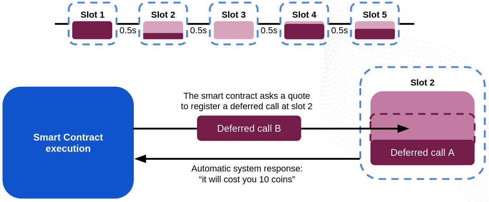
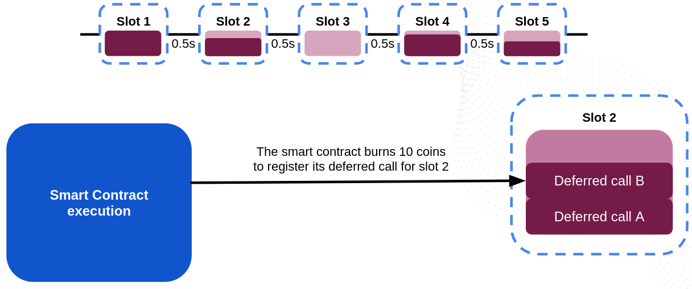
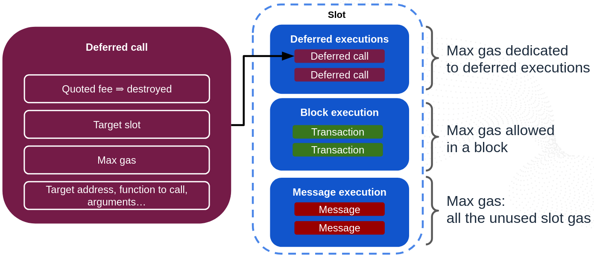
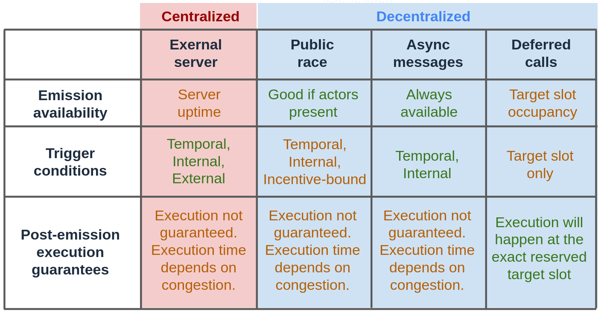

# Massa's Autonomous Smart Contracts

Here we will explain how Massa's Autonomous Smart Contracts work by constructing all their features step by step.
Make sure you have read the [introduction to Autonomous Smart Contracts](./intro) before diving into the details.

Massa provides three features that enable smart contracts to operate autonomously:
* an absolute clock
* async messages: those resemble normal user-emitted operations but can be emitted by smart contracts in order to execute something in the future
* deferred calls: a way to schedule a future call

## The clock: Massa is a timed blockchain

### Slots and block execution

In Massa, time is divided in 0.5 second intervals through Slots (see [the basic concepts](/docs/learn/architecture/basic-concepts.mdx).
Slots are absolute points in time: the first slot happened at the genesis timestamp (`15/01/2024 12:00:00 UTC`) and there is one slot every 0.5 second since genesis.

At each slot, a block producer is selected to produce a block.
The block producer picks operations from the pool of non-executed operations ("mempool") that it has observed propagating in the network, and includes them in their block for execution.
If the blocks are full, pending operations are competing for resources, and therefore block producers will prioritize operations that bring them higher fees compared to the resources they occupy.

See [the basic concepts](/docs/learn/architecture/basic-concepts.mdx) and [the operation lifecycle](/docs/learn/architecture/operation-lifecycle.mdx) for more details.

When the time of a slot is reached, that slot is executed by all nodes.

During the execution of a slot, the block produced for that slot is executed by all nodes.
It can happen that the block producer did not produce their block, in which case no block is executed during the execution of the slot (it's a "miss").
When a block is executed, the operations it contains are executed in the order they were included in the block.

### Operations in Massa

Here is what a typical operation in Massa looks like:

It contains:
* a Fee (tip) given to block producers to motivate them to include the operation in their block and limit flooding,
* validity conditions (validity start and end slots) to ensure the operation is executed only in a specific time window,
* info on resource usage, typically the amount of gas consumed by the operation,
* the payload which can be the execution of a smart contract or a simple transfer of tokens.

Read about [the operation lifecycle](/docs/learn/architecture/operation-lifecycle.mdx) for more details.

### Having users race for automation

One trick used by some protocols to achieve decentralized automation is to let users race and pay the first one that manages to trigger an expected call.
Public race is typically used in lending protocols in which users race to detect under-collateralized positions and send operations to liquidate them, pocketing a reward.

This approach works on Massa as well, but it has several limitations:
* it only works for suitable use cases in which there is a reward for users
* it inherits of the usual limitations of operations: the need for private keys and signing, the need to pay fees, potential delays, etc.

Another problem is that having many users race can result in many operations being sent to the network by many users at the same time, which can cause overload issues.

## Async messages: allowing smart contracts to emit operation-like messages

### General idea

Why would only external users be allowed to emit operations?
The idea is that if we allow smart contracts to emit something that looks like operations (we call those "Async Messages"),
they could schedule future calls to themselves or to other smart contracts in order to achieve autonomy.

Here is how it works:

When a smart contract is executed, it can emit async messages that will be sent to a separate mempool which,
contrary to the classical mempool, is deterministic and synchronized between all nodes.
All nodes see exactly the same autonomous mempool at each final slot.

When a slot is executed, nodes start by executing the block it contains (if any).
Then, all nodes pick async messages that are ready to execute from the autonomous mempool and execute them by prioritizing them by the same criteria that block producers use for operations:
fee vs resource (gas) usage.
Just like for block production, the available gas for async message execution is limited within a slot.
The difference here is that all nodes pick exactly the same async messages to execute at the end of the slot, through an automated algorithm that ensures that all nodes stay in sync.
This means that async messages can get executed at a given slot even if there was no block produced at that slot.

A smart contract executed by an operation or an async message can in turn emit more async messages.

### Async message structure

Here is what an async message looks like:

It resembles a normal operation as it contains:
* A Fee (tip) that is **fully burned** because anti-flood is needed, but since inclusion is deterministic, there is no need to incentivize block producers. All token holders profit from the burn.
* Validity conditions can be one or all of the following:
    * start and end validity slots: the async message can only be executed in a specific time window
    * require a specific entry to change in the blockchain to enable the message: this is useful to only trigger the message when a specific on-chain event happens
* Info on resource usage: here only gas usage.
* The payload describing the call of a smart contract function. The contents match those of a `CallSC` operation (`target_address`, `target_function`, `parameters`, `coins`). Read about [the operation lifecycle](/docs/learn/architecture/operation-lifecycle.mdx) for more details.

When an async message is emitted by a smart contract, `fee + coins` are taken away from the smart contract's balance.
`fee` is burned (see above) and `coins` is locked in the message to be used as the `coins` parameter for calling the target smart contract function when the message is executed in the future.

### The power of Async Messages in Massa

Async messages are executed independently of blocks.
This means that smart contracts in Massa do not need block executions to run over time: they can live by themselves.
This is possible because the full async message lifecycle is on-chain, deterministic and synchronized between all nodes:
every node knows exactly how each smart contract should evolve in time.

In other words, blocks in Massa are just a way to ensure security and to inject data and user requests from the outside world into the blockchain,
but the smart contracts themselves can live and evolve autonomously within the blockchain.

This also means that, just like normal users do for operations, smart contracts in Massa need to be handling the fee payments for the async messages they emit. 

Also, contrary to operations, there no need to handle private keys and signing!

### Limitations of Async Messages

Async messages are inspired by operations, and therefore they are subject to some of their limitations:
* In case of congestion of the autonomous mempool, the fee of the async message will determine its priority for execution. This means that if the fee is too low, the message execution might be delayed or not happen at all.
* If the async message expires without having been executed, it is dropped from the autonomous mempool and the locked `coins` are sent back to the smart contract that emitted the async message.
* If the autonomous mempool is full, the lowest priority async messages (lowest fee over gas ratio) are dropped from the mempool and the locked `coins` are sent back to the smart contract that emitted the async message. They won't be executed.

## Deferred calls: scheduling future calls with guaranteed execution

As a complementary solution to async messages, Massa also provides a way for smart contracts to schedule future calls,
but this time with a full guarantee that not only the scheduled execution will happen, but also that it will happen exactly at the slot decided by the smart contract.

### General description

Deferred calls work in a fundamentally different way compared to async messages and provide different advantages and drawbacks.
Here is an overview:

### How are deferred calls scheduled?

A smart contract can schedule a deferred call in two steps:
* step 1: the smart contract requests a quote to schedule the call at a given future slot and provides the call parameter length and max amount of gas necessary for the call.
  The system tells the smart contract whether there is still enough gas available at the desired slot, and the fee the smart contract would need to burn to schedule the requested call.
* step 2: if the smart contract agrees with the quote, it pays the quoted fee and any call coins, and the system schedules the call for the desired slot.

Here are more details:

### Step 1: Requesting a quote

To schedule a future call, a smart contract needs to request a quote from the system with the following parameters:
* the target slot at which the call should happen
* the max amount of gas the call will need
* the size of the arguments to pass to the called function

The system then performs the following steps:
* If the target slot is at the current slot or the past, or too much in the future (later than `DEFERRED_CALL_MAX_FUTURE_SLOTS` slots from now), the quote is rejected.
* At each slot, there is `DEFERRED_CALL_MAX_ASYNC_GAS` assigned for deferred calls. If, given the already scheduled deferred calls at the target slot, there is not enough gas left for the new call, the quote is rejected.
* A fee is automatically calculated and returned by the system using an algorithm inspired by airplane transport pricing:
    * there is a base fee that is adjusted slowly over time based on the average usage to respond to market changes
    * the fee increases with the amount of gas requested
    * the fee increases with the occupancy of the target slot
    * the fee increases with the average occupancy of all slots currently available for reservation
    * there is an extra fee for storing the arguments of the call in the state according to the logic given by [storage costs](/docs/learn/storage-costs). This charge is refunded to the emitter of the deferred call when the deferred call is removed from the state (eg. when it is executed).

If the quote does not match the expectations of the smart contract,
it can quote again at a different slot or different parameters, or simply trigger some notification or backup mechanism.

### Step 2: Registering a deferred call

If the smart contract agrees with the quote, it can request the registration of the deferred call by providing:
* the slot at which the call should happen
* the max amount of gas the call will need
* the target smart contract address to call
* the target function name to call
* the parameters of the function to call
* `coins` to pass for the call

If the deferred call is valid and the target slot is properly available (i.e. a quote would not return a rejection, see above),
the system spends `fee + coins` from the smart contract balance and schedules the call for the target slot.
The `fee` is burned and the `coins` are locked in the deferred call.

Once registered, the deferred call is guaranteed to be executed at the target slot by all nodes, independently of blocks and async messages.
After registration, a unique ID of the deferred call is returned to the smart contract.

### How are deferred calls executed?

During the execution of a slot, executions happen in the following order:
* first the deferred calls scheduled for that slot are executed (if any)
* then the block produced for that slot is executed (if any)
* then, any async messages that are ready to execute (if any) are executed as long as there is enough remaining slot gas to fill all the available slot gas that was not used by the block or deferred calls.

Just like async messages, deferred calls are executed independently of blocks.

When a deferred call is executed, the `coins` locked in the call are used as the `coins` parameter for calling the target smart contract function.
The storage costs for the arguments of the call are sent back to the smart contract that registered the deferred call.

In case of execution failure (non-existent target address/function, VM runtime error...), the `coins` locked in the deferred call are sent back to the smart contract that registered the deferred call.

### Cancellation

Smart contracts can decide to to cancel the execution of a deferred call they registered at any time before the target slot is reached.
To do this, a smart contract can request the cancellation of a deferred call by providing its unique ID.
When cancellation is requested, the `coins` of the call are sent back to the smart contract that registered the deferred call, but the `fee` is not refunded.
Also note that, in order to avoid any manipulation of the predictive fee market,
the occupancy of the target slot is not updated when a deferred call is canceled and remains the same, as if the deferred call was still there.
At the moment the call would have been executed if it weren't canceled, the coins locked for storing the function arguments are sent back to the caller.

### The power of Deferred Calls in Massa

Deferred calls are extremely powerful because they provide a way for smart contracts to schedule future calls with a full guarantee of execution.
This means that smart contracts can rely on deferred calls to perform actions at an exact time in the future with strong guarantees.
They are the most suitable for critical and time-sensitive applications.

### Limitations of Deferred Calls

Contrary to async messages, deferred calls can only be registered up to `DEFERRED_CALL_MAX_FUTURE_SLOTS` slots in the future.
Their validity conditions are also much more restricted than async calls: only the target slot can be chosen, no other triggers.

## Summary: Centralized Servers vs Public race vs Async Messages vs Deferred Calls

Each of the four methods has its own advantages and drawbacks:

Typically, Async Messages are perfect to make NFTs evolve over time,
add redundancy on detecting on-chain events in case keepers are down,
and perform cosmetic actions, cleanups and so on...

Deferred Calls are perfect for critical and time-sensitive applications in which there is no room for failure,
at the cost of lower expressivity.

