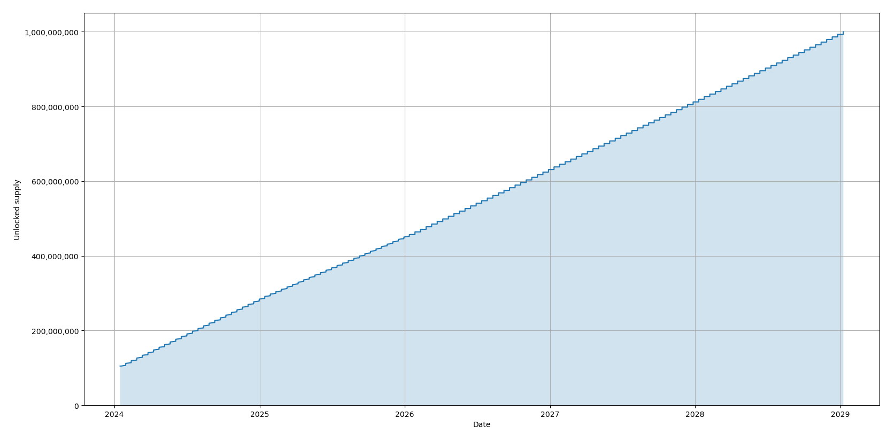
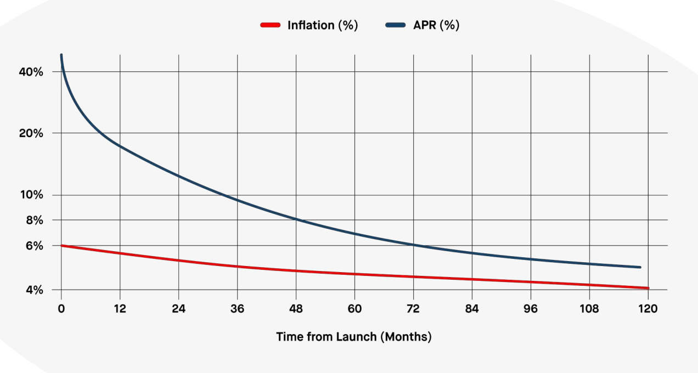

# Massa Tokenomics

## Introduction

:::note
This page reproduces most of the whitepaper's Tokenomics section, with additional details and updates.
:::

Massa, true to its values, has implemented a unique tokenomics model that emphasizes fairness and decentralization. This model ensures that the Massa token is distributed widely among the community, reducing the risk of centralization that can result in unfair voting practices, price manipulation, and security compromises:
- **Unfairly-distributed voting**: When a small number of entities control a significant portion of a blockchain's tokens, they can disproportionately influence governance decisions, undermining the democratic principles that underpin decentralized systems.
- **Price manipulation**: Token centralization can also lead to price manipulation, as large holders can exert undue influence on the market, creating artificial fluctuations that distort the true value of the token.
- **Security compromises**: A centralized token distribution can lead to security vulnerabilities, as malicious actors can target the limited number of entities controlling a large portion of the token supply. It also generates centralization in block production, leading to protocol-level risks.

Massa is committed to maintaining the highest standards of decentralization, with the goal to achieve a Nakamoto coefficient of over `1,000`, ensuring that control and decision-making power are widely distributed across the community. Achieving this not only requires efforts on the technical and legal design, but also on the coin distribution. On this aspect, we crafted three main particularities compared to other L1 blockchain coin distributions:
- **Less tokens for the company/founders**: Massa Labs and founders are allocated `12%` of the total supply.
- **Less tokens for insiders**: The maximum number of tokens bought per entity in all ourtoken sales is relatively small. For instance, the cap was `1%` of the total supply in the
seed sale, allowing a record number of `100` backers in such a sale. Also, the supply allocated to these private sales is only `16%` in total.
- **More tokens for future builders and stakers**: the Decentralization Program sets aside `30%` of the supply to grow the future builders and stakers community, with the aim to achieve full decentralization in a transparent way. 

These steps together improve the token decentralization, limit the influence of early insiders and VCs, and limit the formation of whales whose only remaining option is to buy on the market.

## Initial Coin Distribution

The total initial token supply is `1,000,000,000` Massa tokens. These initial tokens are created in the genesis ledger. They are distributed as follows.

- **Massa Labs & Founders**: `12%`, `120,000,000` tokens. This allocation goes to the team, the founders and a reserve for Massa Labs, to ensure that the main development team is invested in the project's long-term success. These coins are vested linearly for `60` months, with a `5%` initial unlock.
- **Private Sales**: Up to `16%`, `160,000,000` tokens. These coins are vested linearly for `24` months, with a `30%` initial unlock.
- **Community and Ecosystem**: `31%`, `310,000,000` tokens. This allocation is managed by the Massa Foundation. Its purpose is to foster the growth of the Massa community and ecosystem in the long term through grants, marketing actions, partnerships and other programs. These coins are vested linearly for `60` months, with a `5%` initial unlock.
- **Testnet Incentive Program**: up to `8%`, `80,000,000` tokens. The Testnet Incentive Program rewards the thousands of node runners who successfully participated in the testnet. These coins are vested linearly for `24` months, with a `30%` initial unlock.
- **Public Sale**: `3%`, `30,000,000` tokens. These coins are going to be vested for some time, cf future updates.
- **Decentralization Program**: `30%`, `300,000,000` tokens. In the initial ledger, these coins are vested for `60` months with a `24`-month cliff and then `36` months linear. Tokens not distributed after `96` months will be burnt. They are composed of:
 - **100k-nodes Program**: `20%`, `200,000,000` tokens. The goal of this pool is to grow the number of individual stakers participating in the security of the network and in the core governance. Compared to the coin distribution of other L1s biased towards insiders who later sell large chunks in opaque deals or on the market, this alternative mechanism provides more transparency and decentralization. This pool, managed by the Foundation, is dedicated to be bought by new node runners with a low cap per person and at a slow pace between `2` and `8` years post-mainnet, with vesting.
 - **2k-builders Program**: `10%`, `100,000,000` tokens. The goal of this program is to grow a larger builder community with many grants, involving the Massa holders in the decisions to give grants. These grants have a smaller size than with the main grant program: they are capped at `50k` tokens per project. 

## Nakamoto Coefficient

With this data, we can compute the Nakamoto coefficient of the coin after full distribution. The Nakamoto coefficient is computed as the minimum number of independent entities/persons required to reach `50%` of the total supply. We take the most concentrated categories and count the expected number of entities/people until we reach `50%`:
- Massa Labs: `12%`, at least `100` people
- Private sales: `16%`, at least `100` people
- Community and Ecosystem: expecting `1,000+` people in the first `22%`.

Thanks to the fair distribution with smaller pools for insiders and larger pools dedicated to the community, the Nakamoto coefficient of Massa aims to be well over `1,000` on the long-term when all the categories are distributed. On the short-term, only parts of these categories will be effectively disctributed. The next section describes the distribution right on mainnet launch.

## Genesis Ledger

The genesis ledger is the initial distribution of coins when the network starts. Some of these coins appear as initial rolls instead of tokens (1 roll = 100 tokens) giving the ability to stake right from launch.

The genesis ledger files have been set up in this GitHub [folder](https://github.com/Massa-Foundation/genesis-ledger/tree/main/node_initial_setup).

- [genesis_timestamp.json](https://github.com/Massa-Foundation/genesis-ledger/blob/main/node_initial_setup/genesis_timestamp.json): file containing the start date of the Massa mainnet.
- [initial_ledger.json](https://raw.githubusercontent.com/Massa-Foundation/genesis-ledger/main/node_initial_setup/initial_ledger.json): file containing the initial unlocked coins.
- [initial_rolls.json](https://github.com/Massa-Foundation/genesis-ledger/blob/main/node_initial_setup/initial_rolls.json): file containing the initial rolls: more than `1,000` node runners have registered to be initial stakers right from launch!
- [deferred_credits.json](https://raw.githubusercontent.com/Massa-Foundation/genesis-ledger/main/node_initial_setup/deferred_credits.json): file containing all the scheduled unlocking of coins.

The total number of tokens in `initial_ledger.json`, `initial_rolls.json` (`x100` tokens per roll), and `deferred_credits.json` is exactly `1,000,000,000`. These files have been generated with a [script](https://github.com/Massa-Foundation/genesis-ledger/blob/main/generator.py), from this [data](https://github.com/Massa-Foundation/genesis-ledger/tree/main/input_listings), where you can find the following:
- [backers.json](https://github.com/Massa-Foundation/genesis-ledger/blob/main/input_listings/backers.json): backers of Massa Labs who gave their addresses in time. Backers who did not provide their addresses have their coins kept in address `AU1PGvG4x1rmFaYBgSNVmgpPDkWvGtNqS2Jc7BjupmVjkce8dBai` for now.
- [dashboard_data.json](https://raw.githubusercontent.com/Massa-Foundation/genesis-ledger/main/input_listings/dashboard_data.json): here you can find participants of the dashboard campaign, ambassadors, and testnet node runners who were eligible for a reward, with corresponding coins and if they want to be initial stakers. These tokens are vested for `24` months, with a `30%` initial unlock, and the release is approximately once per month, with some random noise to smooth the unlockings (e.g. on month `3`, a user might get tokens released on day `3` while another gets tokens on day `10`).
- [foundation.json](https://github.com/Massa-Foundation/genesis-ledger/blob/main/input_listings/foundation.json): here are the three main addresses of the Massa Foundation. The first corresponds to the `310,000,000` tokens from category "Community and Ecosystem", from which above rewards were deducted. These tokens are vested for `60` months. The second is reserved for a public sale. These tokens are unlocked for now, but they are going to move to a vested smart contract for users to claim their tokens. The third address is the decentralization program address, with `2` years cliff and then `3` years linear vesting.
- [founders.json](https://github.com/Massa-Foundation/genesis-ledger/blob/main/input_listings/founders.json) is an allocation reserved for founders. These tokens are unlocked at genesis and will be moved just after launch to a vested smart contracts where tokens will be claimable.
- [labs.json](https://github.com/Massa-Foundation/genesis-ledger/blob/main/input_listings/labs.json). These are Massa Labs' tokens, with `5%` as initial rolls to start staking right from launch, together with the community, and the other `95%` vested for `60` months.

## Expected Circulating Supply

Taking into account the vesting schedules of all categories, we can estimate the evolution of the circulating supply. Note that many of these tokens will not be effectively circulating although counted as circulating here, because they will be held as reserves by Massa Labs and Massa Foundation even when unlocked.
This figure does not account for staking rewards (see next section).

## Staking Rewards

Staking is the process of running a validator node verifying the blockchain and creating blocks. In Massa as in other Proof-of-Stake blockchains, nodes are selected to create blocks based on their deposited coins –their stake in the blockchain.

As staking improves the decentralization and security of the network, this behavior is incentivized by staking rewards: the higher the number of staked coins, the higher the number of created blocks and received rewards.

To improve decentralization and dedicate rewards to independent node runners, there is no delegation mechanism in Massa, and custodial staking is limited by the [community charter](https://github.com/massalabs/massa/blob/main/COMMUNITY_CHARTER.md).

A minimum number of coins must be deposited to be able to stake, corresponding to one roll. The number of coins in a roll is set to `100`. Users deposit coins to get a number of rolls and stake with these rolls. When they want to stop staking, they can get back their coins after a small locking period and lose the corresponding rolls. When the staking address is selected to produce a block, the node is expected to produce exactly one block.

If the node is offline for some reason, it misses the opportunity to produce the block and to get the reward. If the node is missing these opportunities too often, it is automatically deactivated and its rolls are sold and fully given back as coins. If the node produces more than one block in a selected slot, this is considered as bad behavior and is punished with slashing: one roll is slashed, completely lost and no coins are given back.

At each slot, one staking address is selected to produce a block, and in order to improve consensus speed, `16` other addresses are selected to create endorsements —votes about the best blocks. A maximum minted reward of `1.02` tokens is distributed per slot. If there was a block in this slot, the reward is distributed as follows:
- `0.06` tokens are given to the block creator
- For each endorsement included in the block (up to `16`)
  - `0.02` tokens are given to the block creator
  - `0.02` tokens are given to the endorsement creator
  - `0.02` tokens are given to the creator of the endorsed block

Block and endorsement creators also share the gas fees of all transactions included in the block, and half of the slashed coins, the other half being burnt. However, all the fees of autonomous smart contracts are burnt as they run outside blocks. 

There are `2` slots per second in Massa architecture, so these rewards add up to a maximum of `64,377,504` newly-minted Massa tokens per year, distributed to active staking nodes. The inflation rate is therefore approximately `6.4%` during the first year, and decreases each year as the total supply increases.

As less than the total supply is expected to be staking at any point in time, the actual return per year for active stakers will be higher than this percentage. The next figure shows the maximum inflation rate and an estimation of the annual percentage return (APR) for staking nodes over time.

### Example: How to compute my expected staking rewards ?

Let's assume I currently have `20` initial rolls from genesis, and after launch I buy `3` other rolls, that's `23` rolls in total, equivalent to `2,300` tokens, that I currently use to stake with my node.

I can monitor the total number of rolls currently staked on the network on the Massa [explorer](https://explorer.massa.net/). Let's assume I see that `500,000` rolls are staked (low number, maybe only in the first weeks after mainnet). I thus produce `0,0046%` of blocks and endorsements. 

There are `172,800` blocks per day, so I expect to produce `8` blocks per day on average, but also approximately `127` endorsements per day. The maximum rewards given per block is `1.02` tokens (for block and endorsement producers), which is `176,256` tokens per day. Thus I can expect `176,256 * 0,0046% = 8.1` tokens per day for my `23` rolls, assuming `500,000` rolls are staked in total, and assuming I am always online and I don't miss a block! 

These rewards do not take into account potential gas fees that will be set by users if the network becomes congested one day.

The staking rewards are unlocked, so after `13` days, I should have `105` tokens and I will be able to buy a `24th` roll!

