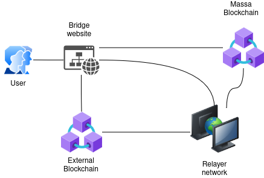
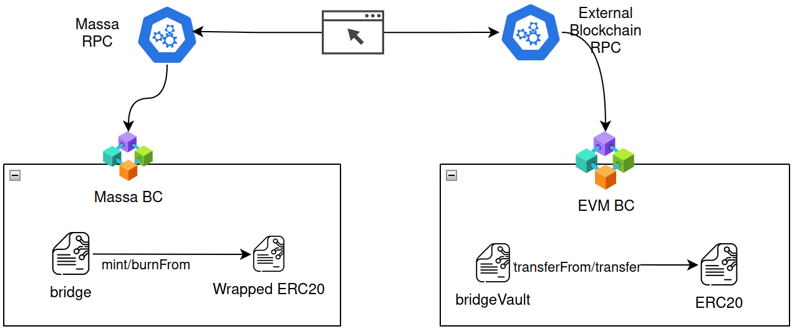

# Architecture and Security Overview

This page presents an overview of the architecture and security measures implemented in the bridge between the Ethereum and Massa blockchains. The bridge is designed to facilitate the secure transfer of assets between the two networks, ensuring the integrity and reliability of cross-chain transactions.
Our system is designed to ensure the secure, efficient, and transparent bridging of assets, leveraging a lock-mint and burn-redeem scheme underpinned by state-of-the-art security practices.

## System Architecture

### Component Overview

The bridge system comprises several key components:

- **Massa Bridge UI**: Serves as the user interface for initiating bridge transactions. It supports wallet connections and transaction initiations for both Ethereum and Massa blockchains.
- **BridgeVault Contract (Ethereum)**: Acts as the custodian of assets on the Ethereum side. It is responsible for locking assets during the bridge process and executing redeem transactions based on verified requests.
- **Bridge Contract (Massa)**: Handles the minting of tokens on the Massa blockchain in response to locked assets on Ethereum and manages the burning of tokens for redemption back to Ethereum.
- **Relayer Network**: A set of independent nodes responsible for monitoring bridge transactions, verifying events, and facilitating the cross-chain communication necessary for asset transfers.

### User flow

To initiate bridging from Ethereum to Massa, a lock transaction is sent to the BridgeVault contract on Ethereum. This lock transaction will transfer the assets from the user's wallet to the BridgeVault contract, locking them in the process. In order to ensure that the bridge operation meet all the requirements, users should always use the Massa bridge UI. Once the lock transaction has received enough confirmations, it will be handled by the relayer network; On detecting a lock event, each individual relayer will produce a signature corresponding to this particular bridge operation. Once all of the three relayers have signed the lock transaction, the relayer network will forward this bridge operation to the Bridge contract on Massa. The Massa Bridge contract will then verify the signatures, and mint the corresponding amount of tokens to the user's wallet on Massa. The user will then receive a notification that the mint operation has been completed.

To initiate bridging from Massa to Ethereum, a burn transaction is sent to the Bridge contract on Massa. This burn transaction will transfer the assets from the user's wallet to the Bridge contract, burning them in the process. Once the burn transaction has received enough confirmations, it will be handled by the relayer network; On detecting a burn event, each individual relayer will produce a signature corresponding to this particular bridge operation. During the process, the Massa Bridge UI will query the relayer network for the signatures. Once all of the three relayers have produced their signatures, the Massa bridge UI will prepare the redeem transaction. The user will then sign and send the redeem transaction to the Ethereum blockchain, triggering the release of the tokens. 

### Security Measures

The BridgeVault contract on Ethereum holds the assets locked during the bridging process. The only way assets can be redeemed is by sending a message signed by the 3 out of 3 nodes of the relayer network. This ensures that the assets are only released when the relayer network has verified the corresponding burn transaction on Massa. The public keys of the relayer nodes are stored in the Bridge contract on Massa, and can only be updated by a gnosis safe multisig wallet controlled by the bridge operators. Moreover, a 48h timeLock from Openzeppelin is implemented in the Bridge contract on Massa, which requires a 48h delay before the relayer network can update the public keys. This ensures that the bridge operators have enough time to intervene in case of a malicious update of the public keys. 
The BridgeVault contract can charge fees. However they have been set to 0 for the time being.

**Gnosis safe**
Safe proxy address: [0x5d752840501b2d2f4841accf53794d0ed3e2c3eb](https://sepolia.etherscan.io/address/0x5d752840501b2d2f4841accf53794d0ed3e2c3eb)

| Signer Name | Address                                   | Status   |
|-------------|-------------------------------------------|----------|
| Damir       | 0xAbC1234...EfgH5678                      | Active   |
| Adrien      | 0xIjk9012...LmnO3456                      | Active   |
| SRE         | 0xPqr7890...StuV1234                      | Inactive |

The Bridge contract on Massa is responsible for minting the tokens in response to the locked assets on Ethereum. The Bridge contract can only mint tokens when it receives a message signed by 3 out of 3 nodes of the relayer network. The synthetic token contracts ownership, has yet to be transferred to a multisig wallet after deployment. The public keys of the relayer nodes are hardcoded in the contract and cannot be updated. This contract as well can be paused for maintenance or security.
The Bridge contract can charge fees but have been set to 0.

The relayer network is a set of independent nodes responsible for monitoring bridge transactions, verifying events, and facilitating the cross-chain communication necessary for asset transfers. The three nodes are hosted on different cloud providers to avoid common points of failure. For redundancy, each node has a fallback mechanism and redundant RPC connections.

The Massa Bridge smart contracts have undergone security audits conducted by Certik, the report is publicly available [here](https://drive.google.com/file/d/1onla7nqsow26RZYXfJE2ju0vGwdjfttA/view?usp=sharing).

#### Lock-Mint Use Case

##### User Interaction:

- A **User** accesses the **Bridge Website** via a browser connected to wallets.
- The **User** opts to transfer assets from an **EVM blockchain** to the **Massa blockchain**.
- The **User** signs and sends an approval transaction and then a lock transaction to the **EVM blockchain** using their wallet provider.

##### Blockchain and Relayer network Interaction:

- The **EVM blockchain** executes the transaction and notifies the **Relayer network**.
- Each instance receives the lock event and signs transaction data.

##### Massa blockchain interaction:

- Once sufficient **Relayer network** signatures are collected, the **Relayer network** sends the mint transaction to the **Massa blockchain**.
- The **User** receives notification upon successful execution of the transaction on the **Massa blockchain**.

#### Burn-Redeem Use Case

##### User Interaction:

- A **User** accesses the **Bridge website** via a browser connected to wallets.
- The **User** opts to transfer assets from the **Massa blockchain** to an **EVM blockchain**.
- The **User** signs and sends an approval transaction and then sends a burn transaction to the **Massa blockchain** using their wallet provider.

##### Blockchain and Relayer network interaction:

- The **Massa blockchain** processes the burn transaction and notifies the **Relayer network**.
- Each instance receives the burn event and signs a redeem transaction.

##### EVM blockchain interaction:

- Once sufficient **Relayer network** signatures are collected, the **Bridge website** prepares the corresponding transaction.
- The **User** signs and sends the redeem transaction to the **EVM blockchain** using their wallet provider.
- Once the redeem transaction is executed on the **EVM blockchain**, the **User** is notified of its completion.

### On-chain Smart Contracts

