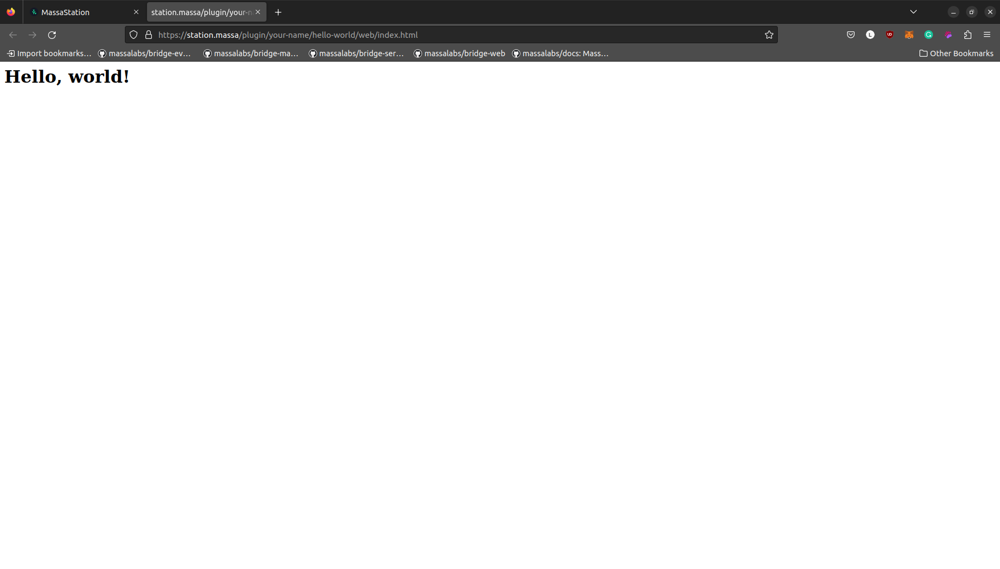

# Build a Hello World Massa Station plugin

Welcome, Developer! You're about to embark on an exciting journey where you'll build your very first Massa Station
plugin. If you're thrilled about the world of blockchain, smart contracts, and dApps, you've come to the right place!

As the most decentralized blockchain, Massa is a community-driven project. Thus, we tried to make as few assumptions as
possible about the form and features that a module should have. As a result, *Massa Station* modules can be developed in
any language, be more web2 or web3-oriented, and can be as simple or complex as you want them to be. In this tutorial,
we are going to build the simplest of the programs; a "Hello, World!" *Massa Station* plugin.

:::info
If you don't know what are Massa Station and Massa Station Plugins, you can read this quick introduction [here](/docs/massaStation/home.mdx).
:::

## What are we going to do?

In this tutorial, we are going to develop a simple "Hello, World!" Massa Station plugin. This plugin will be composed of two parts: a back end and a front end. The back end will be a simple API that will allow Massa Station to interact with the plugin. The front end will be a simple web page that will be displayed when the plugin is called without any endpoint specified.

- **Prerequisites**: We will install the necessary tools to develop the plugin.
- **Part 1**: We will create an API server using go-swagger.
- **Part 2**: We will register our API server to Massa Station.
- **Part 3**: We will define our endpoint.
- **Part 4**: We will add a frontend to the plugin.
 
## Prerequisites

### Install Golang

Make sure that you have [Golang](https://go.dev/doc/install) installed on your machine. You can check if it is installed by running `go version` in your terminal. If you don't have Golang installed, you can follow the [official installation guide](https://go.dev/doc/install). Make sure you add `go` to the PATH environment variable. 

### Install Go Swagger

Make sure you have [Go Swagger](https://pkg.go.dev/github.com/go-swagger/go-swagger) installed on your machine. If you don't have Go Swagger installed, you can follow the [official installation guide](https://pkg.go.dev/github.com/go-swagger/go-swagger). Also, make sure that the folder containing the Go Swagger binary is added to the PATH environment variable. It's usually located in the default go workspace folder: `$GOPATH/bin`. Once installed, you can check if it is installed by running `swagger version` in your terminal.

### Install Massa Station

Make sure that you have [Massa Station](https://station.massa.net) installed on your machine. You can install it by downloading the installer on the official [Massa Station website](https://station.massa.net). Once downloaded, run the installer and let it guide you through the installation process. 

If you can produce a similar output in your terminal, then you should be good to go:

```bash
❯ go version
go version go1.21.0 linux/amd64
❯ swagger version
version: v0.30.5
commit: (unknown, mod sum: "h1:SQ2+xSonWjjoEMOV5tcOnZJVlfyUfCBhGQGArS1b9+U=")
❯ massastation
2023-08-22T15:28:25.058+0200  INFO  logger/global.go:51 Connected to node server https://buildnet.massa.net/api/v2 (version DEVN.24.1)
2023-08-22T15:28:25.060+0200  INFO  logger/global.go:62 Serving massastation at http://[::]:80
2023-08-22T15:28:25.061+0200  INFO  logger/global.go:62 Serving massastation at https://[::]:443

```

## Setting up the project and creating the plugin's API.

### Initialize the project

Navigate to your favorite folder and create a new folder for your project. In this tutorial, we will name it `my-plugin`. Navigate to the `my-plugin` folder and initialize it as a go module by running the following command:
```bash
go mod init my-plugin
``` 
This will create a `go.mod` file in the `my-plugin` folder.

### Define the server stub configuration

Now, let's create the server stub. To do so, we will use the [go-swagger](https://pkg.go.dev/github.com/go-swagger/go-swagger) tool. Go Swagger allows you to generate a server stub from a swagger file. The server stub will contain the API's endpoints and the necessary code to run the server.

So go ahead and create an `api` folder in the `my-plugin` folder. 
Then, create a `swagger.yml` file in the `my-plugin/api` folder. This file will contain the server specification. Add the following configuration to the `swagger.yml` file:

```yaml
consumes:
  - application/json
info:
  description: Hello world plugin API.
  title: hello-world-plugin
  version: 0.0.0
produces:
  - application/json
schemes:
  - http
swagger: "2.0"
paths:
  /:
    get:
      operationId: defaultPage
      responses:
        "301":
          description: Move to the default endpoint
```

Now we are going to need a target directory to store the generated server stub.
So go ahead and in the `my-plugin/api` folder, create a new folder named `server`.

Navigate back to the root directory `my-plugin` and create a `generate.go` file. This file will contain the command that generates the server stub from the swagger file when you run `go generate ./...`.

Add the following code to `generate.go`:

```go
package main

//go:generate swagger generate server --quiet --target api/server --name my-plugin --spec api/swagger.yml --exclude-main
```

:::note
Here we are using the `swagger generate server` command to generate the server stub. The `--target` flag is used to specify the target directory. The `--name` flag is used to specify the name of the server. The `--spec` flag is used to specify the swagger file. The `--exclude-main` flag is used to exclude the `main` function from the generated code. We will add our own `main` function later on. 
:::

### Generate the server stub

Now that we have defined the server configuration, we can generate the server stub. To do so, run the following command in the root directory `my-plugin`:
```bash
go generate ./...
```
This will generate the server stub in the `my-plugin/api/server` folder. At this point, you should have the following folder structure:

```bash
my-plugin
├── generate.go
├── go.mod
├── api
│   ├── swagger.yml
│   ├── server
│   │   ├── restapi
│   │   │   ├── server.go
│   │   │   ├── configure_my-plugin.go
│   │   │   ├── doc.go
│   │   │   ├── embedded_spec.go
│   │   │   ├── operations
│   │   │   │   ├── default_page.go
│   │   │   │   ├── default_page_parameters.go
│   │   │   │   ├── default_page_responses.go
│   │   │   │   ├── default_page_urlbuilder.go
│   │   │   │   ├── my_plugin_api.go

```
Once you are done generating the server stub, we are going to need to edit one of the generated file. Indeed, the default CORS setting will block requests between Massa Station plugins. But as requests between Massa Station plugins are local, there is no risk with allowing CORS. 
So go ahead and open the `my-plugin/api/server/restapi/configure_my-plugin.go` file.
Delete the current `setupGlobalMiddleware` function and replace it with the following code:

```go
func setupGlobalMiddleware(handler http.Handler) http.Handler {
    handleCORS := cors.New(cors.Options{}).Handler

    return handleCORS(handler)
}
```

:::tip
At the beginning of the file, you should see the following comment:
```go
// This file is safe to edit. Once it exists it will not be overwritten
```
This comment indicates that the file will not be overwritten when you re-generate the server stub. So you shouldn't have to edit it again when regenerating the server stub.
:::

We will also need to install the `cors` package with the following command:
```bash
go get github.com/rs/cors
```
Then we will need to import it in the `my-plugin/api/server/restapi/configure_my-plugin.go` file. So go ahead and open the `configure_my-plugin.go` file and add the following line to the imports section:

```go
  "github.com/rs/cors"
```

### Create the logic of the API

Create `my-plugin.go` in the root of your project and add the following code that implements the API's logic:

```go
package main

import (
  "fmt"
  "os"
  "os/signal"
  "syscall"
  "time"

  "my-plugin/api/server/restapi"
  "my-plugin/api/server/restapi/operations"

  "github.com/go-openapi/loads"
)
func killTime(quit chan bool) { // creates a ticker that will send a message every 5 seconds
  // creates a ticker that will send a message every 5 seconds
    ticker := time.NewTicker(5 * time.Second) //nolint:gomnd

    fmt.Fprintf(os.Stdout, "Plugin is initializing.\n")

    for {
        select {
        case <-ticker.C:
            fmt.Fprintf(os.Stdout, "Tic!\n") // logs a message every 5 seconds
        case <-quit:
            fmt.Fprintf(os.Stdout, "Plugin is shutting down.\nBye!\n") // logs a message when the plugin is shutting down

            return
        }
    }
}

func initializeAPI() *restapi.Server {
    swaggerSpec, err := loads.Analyzed(restapi.SwaggerJSON, "") // loads the swagger file
    if err != nil {
        panic(err)
    }

    pluginAPI := operations.NewMyPluginAPI(swaggerSpec) // initializes the API
    server := restapi.NewServer(pluginAPI) // creates the server

    server.ConfigureAPI() // configures the API

    return server
}

func main() {
    quit := make(chan bool) // creates a channel to receive the interrupt signal
    intSig := make(chan os.Signal, 1) // notifies the channel when the interrupt signal is received
    signal.Notify(intSig, syscall.SIGINT, syscall.SIGTERM)

    go killTime(quit) // starts the killTime function in a goroutine

    server := initializeAPI() // initializes the API

    if err := server.Serve(); err != nil {
        panic(err)
    }

    <-intSig
    quit <- true
}
```

:::info
The `killTime` function logs a message every 5 seconds. It is used to show that the plugin is running.

The `initializeAPI` function initializes the API and returns the server.
:::

Once you have created the `my-plugin.go` file, and copied the code, we are going to install the imported packages. To do so, run the following command in the root directory `my-plugin`:
```bash
go mod tidy
```

### Test the API

Once you are done editing the `my-plugin.go` file, you should be able to test the API by running:

```bash
go run ./my-plugin.go
```

After five seconds, you should get a similar output:

```bash
❯ go run ./my-plugin.go
Plugin is initializing.
2023/08/22 15:04:39 Serving my plugin at http://[::]:39725
Tic!
```

:::tip
The last numbers correspond to the port the API is running on. It will change each time you restart the plugin.
:::

At this stage, we are running the API in standalone mode. In the next section, we will register the API with Massa Station, to make it run through Massa Station.

## Register to Massa Station

### Install the Massa Station Plugin package

To be able to register the plugin with Massa Station, we need to install the Massa Station Plugin package. Indeed, this package contains the `RegisterPlugin` function that allows us to register the plugin to Massa Station.

Install the following package:
```bash
go get github.com/massalabs/station-massa-hello-world
```

This package will be imported to `my-plugin.go` file. So go ahead and add the following line to the imports section of `my-plugin.go`:
```go
  "github.com/massalabs/station-massa-hello-world/pkg/plugin"
```
The import section of your `my-plugin.go` file should look like this:

```go
import (
  "fmt"
  "net/http"
  "os"
  "os/signal"
  "syscall"
  "time"

  "my-plugin/api/server/restapi"
  "my-plugin/api/server/restapi/operations"

  "github.com/go-openapi/loads"
  "github.com/rs/cors"

  "github.com/massalabs/station-massa-hello-world/pkg/plugin"
)
```
Once this is done, we will add the registration logic to our main function. We want to add the following lines to the main function:

```go
  listener, err := server.HTTPListener()
  if err != nil {
    panic(err)
  }

  plugin.RegisterPlugin(listener) // registers the plugin
```
They should be added right after the `server := initializeAPI()` line. In the end, your main function should look like this:

```go
func main() {
    quit := make(chan bool) // creates a channel to receive the interrupt signal
    intSig := make(chan os.Signal, 1) // notifies the channel when the interrupt signal is received
    signal.Notify(intSig, syscall.SIGINT, syscall.SIGTERM)

    go killTime(quit) // starts the killTime function in a goroutine

    server := initializeAPI() // initializes the API

    listener, err := server.HTTPListener()
    if err != nil {
        panic(err)
    }

    plugin.RegisterPlugin(listener) // registers the plugin

    if err := server.Serve(); err != nil {
        panic(err)
    }

    <-intSig
    quit <- true
}
```

:::info
`plugin.RegisterPlugin` is a function available in the [hello-world plugin package](https://github.com/massalabs/station-massa-hello-world/blob/main/pkg/plugin/register.go).

It facilitates the registration of a plugin with Massa Station, assigning a unique correlation ID to the plugin for identification purposes within the Massa Station system.
:::

### Build the plugin binary and move it to the Massa Station plugin folder

Now that we have implemented the logic to register the plugin with Massa Station, we are going to build the plugin binary, and move it to the Massa Station plugin folder. By doing so, we will make the binary available to Massa Station.

So, go ahead and build a binary of the plugin with the following command:
```bash
mkdir build && go build -o build/my-plugin
```

In addition to the binary, Massa Station needs a manifest file to be able to identify the plugin. So go ahead and create a `manifest.json` file in the root directory `my-plugin`. Add the following configuration to the `manifest.json` file:

```json
{
  "author": "Your name",
  "name": "Hello World",
  "description": "Hello world plugin",
  "logo": "hello_world.svg",
  "home": "",
  "version": "0.0.1"
}
```
Feel free to edit the `manifest.json` file to match your name and the name of the plugin.

As you can see, we referenced a `.svg` file. This file will be the logo of your plugin, that will appear on the Massa Station modules page. So go ahead and create a `web` folder in the root directory `my-plugin`. Then, create a `content` folder in the `my-plugin/web` folder. Finally, add the `hello_world.svg` file that you can download [here](https://github.com/massalabs/station-massa-hello-world/blob/main/web/content/hello_world.svg) to the `my-plugin/web/content` folder.

Finally, move the plugin binary, the manifest, and the `.svg` file to the Massa Station plugin folder. The location of the Massa Station plugin folder depends on your operating system:

On linux or macOS you can use the following command to move the files:

```bash
mkdir -p /usr/local/share/massastation/plugins/my-plugin
cp build/my-plugin /usr/local/share/massastation/plugins/my-plugin
cp web/content/hello_world.svg /usr/local/share/massastation/plugins/my-plugin
cp manifest.json /usr/local/share/massastation/plugins/my-plugin
```

On Windows, you can use the following command in the PowerShell:

```powershell
# Create the directory
$destinationDir = "C:\Program Files (x86)\MassaStation\plugins\my-plugin"
New-Item -ItemType Directory -Force -Path $destinationDir

# Copy the files
$sourceDir = "build\my-plugin"
Copy-Item $sourceDir\my-plugin $destinationDir -Force

$sourceDir = "web\content"
Copy-Item $sourceDir\hello_world.svg $destinationDir -Force

Copy-Item manifest.json $destinationDir -Force
```

### Restart Massa Station and access the module page

Restart Massa Station and access [the module page](https://station.massa/web/store). You should see the plugin in the list of available plugins.


For now, we cannot access it because we haven't implemented any endpoint. So let's do that in the next section.

## Define your endpoint

We are going to add a new endpoint to our plugin that will display a message when called. To do so, we will add a new endpoint to the swagger file, generate the code, add a handler, and register the handler.

### Add a new endpoint to the swagger file

So go ahead and open the `swagger.yml` file in the `api` folder, and append the following code at the end of the file:

```yaml
  /api/hello:
    put:
      operationId: hello
      parameters:
        - in: query
          name: name
          type: string
          description: the name of the person to be greeted.
      produces:
        - application/json
      responses:
        "200":
          description: Greeting content.
          schema:
            type: object
            required:
              - message
            properties:
              message:
                description: Greeting message.
                type: string
                x-nullable: false
        "500":
          description: Internal Server Error - The server has encountered a situation it does not know how to handle.
```

### Generate the server stub

Once you are done editing the `swagger.yml` file, we are going to re-generate the server stub based on the new configuration. To do so, run the following command in the root directory `my-plugin`:

```bash
go generate ./...
```

### Add a handler

Now we are going to add a handler for our new endpoint. To do so, we will create an `endpoints.go` file that will contain the logic of the handler.
So go ahead and create the file `endpoints.go` in the `my-plugin/api` folder. 
Add the following code to the `endpoints.go` file:

```go
package api

import (
  "fmt"

  "my-plugin/api/server/restapi/operations"

  "github.com/go-openapi/runtime/middleware"
)

func Hello(params operations.HelloParams) middleware.Responder {
  target := "World"
  if params.Name != nil {
    target = *params.Name
  }

  return operations.NewHelloOK().WithPayload(
    &operations.HelloOKBody{Message: fmt.Sprintf("Hello, %s!", target)},
  )
}
```

:::info
Here, we are simply returning a 200 OK response with a greeting message that takes the name of the person to be greeted from the query parameters.
:::

### Register the handler

Now we are going to set the handler for our newly created `hello` endpoint. To do so, we will add the following line to the `initializeAPI` function in the `my-plugin.go` file:

```go
pluginAPI.HelloHandler = operations.HelloHandlerFunc(api.Hello)
```

So go ahead and in the `my-plugin.go` file, replace the current `initializeAPI` function with the following code snippet: 
  
```go
func initializeAPI() *restapi.Server {
  swaggerSpec, err := loads.Analyzed(restapi.SwaggerJSON, "") // loads the swagger file
  if err != nil {
      panic(err)
  }

  pluginAPI := operations.NewMyPluginAPI(swaggerSpec) // initializes the API
  server := restapi.NewServer(pluginAPI) // creates the server
  server.ConfigureAPI() // configures the API
  pluginAPI.HelloHandler = operations.HelloHandlerFunc(api.Hello) // sets the handler for the Hello endpoint

  return server
}
```

### Re-build and re-deploy the plugin

Now that we have created our endpoint and the corresponding handler, we need to re-build and re-deploy the plugin. We are going to follow the same steps 2 and 3 of the previous section.
Start by building the binary with the following command:
```bash
go build -o build/my-plugin
```

Then, move the binary, to the Massa Station plugin folder. The location of the Massa Station plugin folder depends on your operating system.

On linux or macOS:

```bash
cp build/my-plugin /usr/local/share/massastation/plugins/my-plugin
```

On Windows, you can use the following commands in the PowerShell:

```powershell
# Copy the files
$sourceDir = "build\my-plugin"
Copy-Item $sourceDir\my-plugin $destinationDir -Force
```

### Test the endpoint

We are going to test the endpoint by calling it with `curl`. The url of the endpoint will vary depending on the naming you used in the previous steps. So the easiest way will be to go to the Massa Station module page, locate your plugin, launch it and copy the url. 
In my case, it is: `https://station.massa/plugin/your-name/hello-world/`.

Run the following command to test the `hello` endpoint we implemented, and don't forget to replace the url with yours:

```bash
curl -X PUT "<INSERT YOUR PLUGIN URL>api/hello?name=John" -H  "accept: application/json""
```

You should see the following output:

```bash
{ "message": "Hello, John!" }
```

Great! We have successfully added a new endpoint to our plugin.

The next step will be to add a frontend to our plugin.

## Add a frontend to the plugin

We are going to add a frontend to our plugin. The process is quite similar to the one we followed in the previous section.
We will add a new endpoint to the swagger file, generate the code, add a handler, and register the handler. Then, we will create a basic HTML page and add the handler to the `initializeAPI` function.

### Add a new endpoint to the swagger file

Once again, we will add a new endpoint to the API. This time, we will add an endpoint that will allow us to serve a static website. To do so, we will add a new endpoint to the swagger file. So go ahead and open the `swagger.yml` file in the `api` folder, and append the following code at the end of the file:

```yaml
  /web/{resource}:
    get:
      operationId: web
      produces:
        - application/json
        - text/javascript
        - text/html
        - text/css
        - text/webp
        - image/png
      parameters:
        - in: path
          name: resource
          type: string
          required: true
          description: Website resource.
      responses:
        "200":
          description: Page found
        "404":
          description: Resource not found.
```

### Generate the server stub

Once you are done editing the `swagger.yml` file, we are going to re-generate the server stub based on the new configuration. To do so, run the following command in the root directory `my-plugin`:

```bash
go generate ./...
```

### Create an HTML page

Now we are going to create a basic HTML page that will be served by the plugin. So go ahead and create an `index.html` file in the `my-plugin/web/content` folder. 
Add the following code to the `index.html` file:


```html
  <html>
    <body>
      <h1>Hello, world!</h1>
    </body>
  </html>
```

### Add the html parser

We are going to create a handler that will read the content of the html file and return it. So go ahead and create a `resources.go` file in the `my-plugin/web` folder. 
Add the following code to the `my-plugin/web/resources.go` file:

```go
package web

import (
  "embed"
  "fmt"
)

const basePath = "content/"

//go:embed content
var content embed.FS

func Content(resource string) ([]byte, error) {
  content, err := content.ReadFile(basePath + resource)
  if err != nil {
    return nil, fmt.Errorf("while reading %s in %s: %w", resource, basePath, err)
  }

  return content, nil
}
```

### Add a handler

We are also going to create an `endpoints.go` file that will contain the logic of the handler. It will point Massa Station to the right resource.
So go ahead and create the file `endpoints.go` in the `my-plugin/web` folder and add the following code:

```go
package web

import (
  "mime"
  "net/http"
  "path/filepath"

  "github.com/go-openapi/runtime/middleware"
  "my-plugin/api/server/restapi/operations"
  "github.com/massalabs/station-massa-wallet/pkg/openapi"
)

// webHandle  handles a Web request.
func Handle(params operations.WebParams) middleware.Responder {
  resourceName := params.Resource

  resourceContent, err := Content(resourceName) // reads the content of the html file
  if err != nil {
    return operations.NewWebNotFound()
  }

  fileExtension := filepath.Ext(resourceName)

  mimeType := mime.TypeByExtension(fileExtension) // gets the mime type of the file

  header := map[string]string{"Content-Type": mimeType}

  return openapi.NewCustomResponder(resourceContent, header, http.StatusOK) // returns the content of the html file
}

// defaultRedirectHandler redirects request to "/" URL to "web/index.html".
func DefaultRedirectHandler(_ operations.DefaultPageParams) middleware.Responder {
  return openapi.NewCustomResponder(nil, map[string]string{"Location": "web/index.html"}, http.StatusPermanentRedirect) // redirects to the html file
}
```
As you can see, we imported the `github.com/massalabs/station-massa-wallet/pkg/openapi` package. This package contains the `NewCustomResponder` function that allows us to return a custom response.
Go ahead and install the package with the following command:

```bash
go get github.com/massalabs/station-massa-wallet/pkg/openapi
```

### Register the handler

Then, we need to add the handler to the `initializeAPI` function:

```go
    ...
  pluginAPI.WebHandler = operations.WebHandlerFunc(web.Handle)
  pluginAPI.DefaultPageHandler = operations.DefaultPageHandlerFunc(web.DefaultRedirectHandler)
    ...
```
So open the `my-plugin.go` file and replace the current content of the `initializeAPI` function with the following code snippet: 
  
```go
func initializeAPI() *restapi.Server {
  swaggerSpec, err := loads.Analyzed(restapi.SwaggerJSON, "")
  if err != nil {
    panic(err)
  }

  pluginAPI := operations.NewHelloWorldAPI(swaggerSpec)
  server := restapi.NewServer(pluginAPI)

  pluginAPI.WebHandler = operations.WebHandlerFunc(web.Handle)
  pluginAPI.DefaultPageHandler = operations.DefaultPageHandlerFunc(web.DefaultRedirectHandler)
  pluginAPI.HelloHandler = operations.HelloHandlerFunc(api.Hello)

  server.ConfigureAPI()

  return server
}
```
As you can see, we are using the `web` package we created in the previous step. So make sure you import it in the `my-plugin.go` file. Your import section should look like this:

```go
import (
  "fmt"
  "net/http"
  "os"
  "os/signal"
  "syscall"
  "time"

  "my-plugin/api"
  "my-plugin/api/server/restapi"
  "my-plugin/api/server/restapi/operations"
  "my-plugin/web"

  "github.com/go-openapi/loads"
  "github.com/rs/cors"

  "github.com/massalabs/station-massa-hello-world/pkg/plugin"
)
```

### Re-build and re-deploy the plugin

As we already did in the previous sections, we are going to re-build and re-deploy the plugin.
Start by building the binary with the following command:
```bash
go build -o build/my-plugin
```

Then, move the binary, to the Massa Station plugin folder. The location of the Massa Station plugin folder depends on your operating system.
:::note
To copy the files, you should make sure that Massa Station is not running.
:::

On linux or macOS:
```bash
cp build/my-plugin /usr/local/share/massastation/plugins/my-plugin
cp web/content/index.html /usr/local/share/massastation/plugins/my-plugin
```

On Windows, you can use the following commands in the PowerShell:
```powershell
# Copy the files
$sourceDir = "build\my-plugin"
Copy-Item $sourceDir\my-plugin $destinationDir -Force

$sourceDir = "web\content"
Copy-Item $sourceDir\index.html $destinationDir -Force
```

### Restart Massa Station and access the module page

Restart Massa Station and access [the module page](https://station.massa/web/store). You should see the plugin in the list of available plugins.
Click on the plugin to launch it. You should see the "Hello, World!" page.



Congratulations! You have successfully created your first Massa Station plugin!
