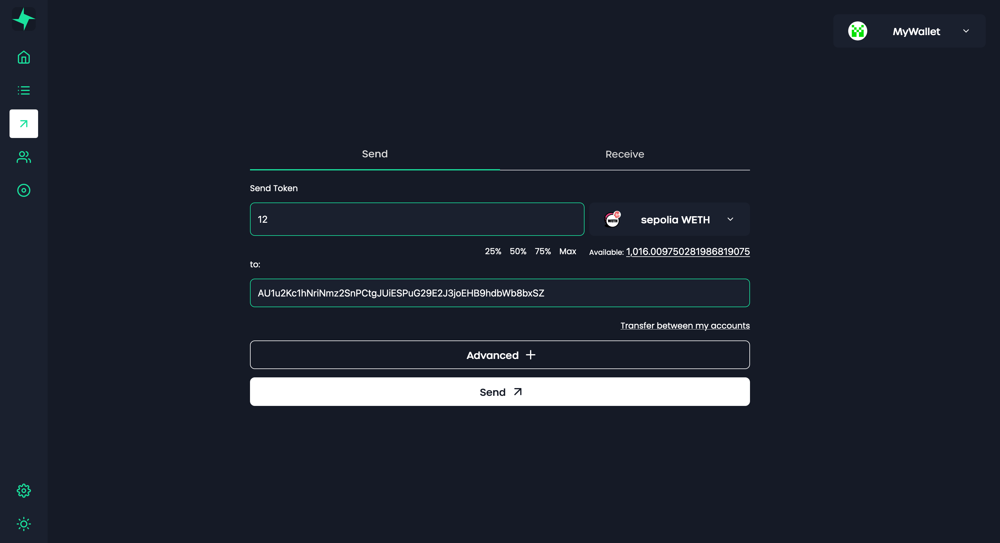

## Sending Funds

1. Open the *Massa Wallet* module.
2. Access to your wallet.
3. Click on the **Send** button.
4. Enter the recipient's address and the amount to send.
    
    
    
5. Confirm the transaction.
    
    
    
6. A popup will appear asking you to sign the transaction.

## Receiving Funds

1. From your wallet dashboard, click on the ‘**Receive**’ button.
2. Copy the address or generate a link:
    1. To copy the address, click on the button at the right of your account address.
        
        
        
    2. To generate a link, click on the ‘**Generate link**’ button and select the amount you want to receive. Once done, click on the ‘**Generate link’** button and copy the link using the button on the right of the link.
        
        
        
3. **Share** the address or the link with the person who wants to send you funds.

:::info
The generated link only works if *Massa Station* is installed and running on the computer of the person who wants to send you funds.
:::
