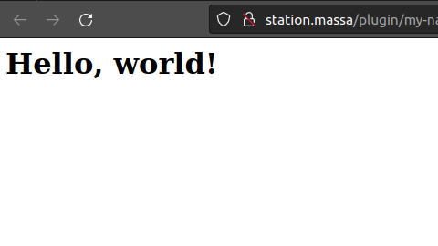

To add a web-app to our plugin,

- Add the right endpoint to the `swagger.yml` file. in the api folder:

```yaml
/web/{resource}:
  get:
    operationId: web
    produces:
      - application/json
      - text/javascript
      - text/html
      - text/css
      - text/webp
      - image/png
    parameters:
      - in: path
        name: resource
        type: string
        required: true
        description: Website resource.
    responses:
      "200":
        description: Page found
      "404":
        description: Resource not found.
```

- Run `go generate ./...` to generate the new endpoints
- Create a basic HTML page `index.html` in the `web/content` folder:
  ```html
  <html>
    <body>
      <h1>Hello, world!</h1>
    </body>
  </html>
  ```
- Add the handler to the `initializeAPI` function.

  - Create `ressources.go` and `endpoints.go`.

    - `ressource.go` reads the content of the html file and returns it:

    ```go
    package web

    import (
      "embed"
      "fmt"
    )

    const basePath = "content/"

    //go:embed content
    var content embed.FS

    func Content(resource string) ([]byte, error) {
      content, err := content.ReadFile(basePath + resource)
      if err != nil {
        return nil, fmt.Errorf("while reading %s in %s: %w", resource, basePath, err)
      }

      return content, nil
    }
    ```

  - `endpoints.go` points massastation to the right ressource

    ```go
    package web

    import (
      "mime"
      "net/http"
      "path/filepath"

      "github.com/go-openapi/runtime/middleware"
      "my-plugin/api/server/restapi/operations"
      "github.com/massalabs/station-massa-wallet/pkg/openapi"
    )

    // webHandle  handles a Web request.
    func Handle(params operations.WebParams) middleware.Responder {
      resourceName := params.Resource

      resourceContent, err := Content(resourceName) // reads the content of the html file
      if err != nil {
        return operations.NewWebNotFound()
      }

      fileExtension := filepath.Ext(resourceName)

      mimeType := mime.TypeByExtension(fileExtension) // gets the mime type of the file

      header := map[string]string{"Content-Type": mimeType}

      return openapi.NewCustomResponder(resourceContent, header, http.StatusOK) // returns the content of the html file
    }

    // defaultRedirectHandler redirects request to "/" URL to "web/index.html".
    func DefaultRedirectHandler(_ operations.DefaultPageParams) middleware.Responder {
      return openapi.NewCustomResponder(nil, map[string]string{"Location": "web/index.html"}, http.StatusPermanentRedirect) // redirects to the html file
    }
    ```

- Finally we need to add the handler to the `initializeAPI` function:

  ```go

      ...

    pluginAPI.WebHandler = operations.WebHandlerFunc(web.Handle)
    pluginAPI.DefaultPageHandler = operations.DefaultPageHandlerFunc(web.DefaultRedirectHandler)

      ...
  ```

- Run again the command to install a plugin defined in [the part 1](/docs/tutorial/massa-station-plugin/create-basic-plugin.mdx)
- Navigate to `http://station.massa/plugin/my-name/my-plugin/web/index.html` and you should access the html page you created.
- You're all set !

  
