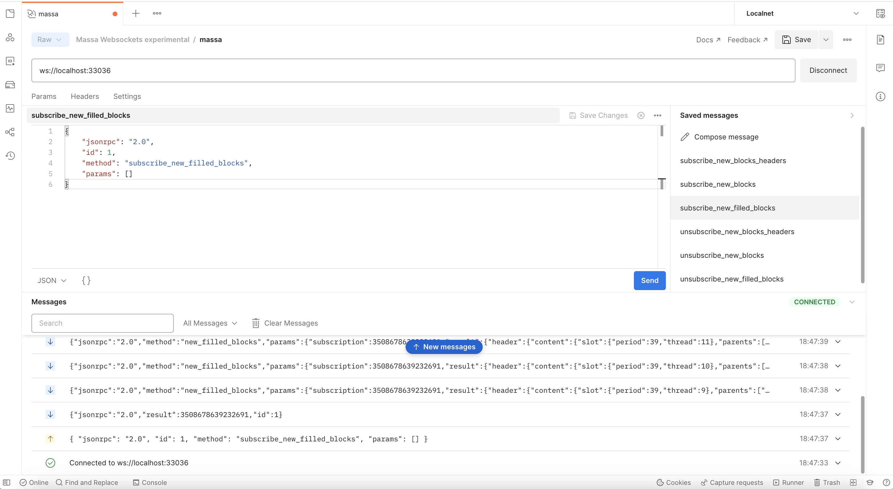

import Tabs from '@theme/Tabs';
import TabItem from '@theme/TabItem';

# Massa JSON-RPC API

The JsonRPC API allows you to communicate with the Massa blockchain.

The Massa JSON-RPC API is splitted in two parts:

- **Private API**: used for node management. Default port: 33034 e.g.
    <http://localhost:33034>
- **Public API**: used for blockchain interactions. Default port:
    33035 e.g. <http://localhost:33035>

The complete Massa [OpenRPC](https://spec.open-rpc.org/) specification is available
[here](https://raw.githubusercontent.com/massalabs/massa/main/massa-node/base_config/openrpc.json).

The [Interactive API Specification](https://playground.open-rpc.org/?schemaUrl=https://test.massa.net/api/v2&uiSchema\[appBar\]\[ui:input\]=false&uiSchema\[appBar\]\[ui:inputPlaceholder\]=Enter+Massa+JSON-RPC+server+URL&uiSchema\[appBar\]\[ui:logoUrl\]=https://massa.net/favicons/favicon.ico&uiSchema\[appBar\]\[ui:splitView\]=false&uiSchema\[appBar\]\[ui:darkMode\]=false&uiSchema\[appBar\]\[ui:title\]=Massa&uiSchema\[appBar\]\[ui:examplesDropdown\]=false&uiSchema\[methods\]\[ui:defaultExpanded\]=false&uiSchema\[methods\]\[ui:methodPlugins\]=true&uiSchema\[params\]\[ui:defaultExpanded\]=false)
documents every available method and allows you to play with the API.

:::info
Massa has a new experimental API with both Http and WebSocket support:
Default port: 33036

- **Http**: used for node management and blockchain interactions. e.g.
    <http://localhost:33036>
- **WebSocket**: used for streaming blockchain events. e.g.
    <ws://localhost:33036>
:::

## Integrations

- **JavaScript**: The [massa-web3](https://github.com/massalabs/massa-web3) TypeScript library
can be used to call the JSON-RPC API... and much more.
- **Postman**: You can find our Massa Postman collections on our official [workspace](https://www.postman.com/massalabs).

## Explore the Blockchain

In this section we'll learn how to interact with Massa blockchain using the public API via
cURL commands which will create JSON-RPC request calls.

### get_status

Summary of the current state: time, last final blocks (hash, thread,
slot, timestamp), clique count, connected nodes count.

<Tabs>
<TabItem value="json (Mainnet)" label="cURL (Mainnet)" default>

```shell
curl --location --request POST 'https://mainnet.massa.net/api/v2' \
--header 'Content-Type: application/json' \
--data-raw '{
    "jsonrpc": "2.0",
    "id": 1,
    "method": "get_status",
    "params": []
}'
```

</TabItem>

<TabItem value="json (Buildnet)" label="cURL (Buildnet)">

```shell
curl --location --request POST 'https://buildnet.massa.net/api/v2' \
--header 'Content-Type: application/json' \
--data-raw '{
    "jsonrpc": "2.0",
    "id": 1,
    "method": "get_status",
    "params": []
}'
```

</TabItem>
</Tabs>

<details>
<summary>Example response: </summary>
<p>

```json
{
    "jsonrpc": "2.0",
    "result": {
        "node_id": "N1VRyXjUaHeJd4Rmr3waVmpZDFzzH5ARRi3f5ye5BYgxBmxHC7X",
        "node_ip": "141.94.218.103",
        "version": "SECU.27.0",
        "current_time": 1699881695772,
        "current_cycle": 208,
        "current_cycle_time": 1699879784000,
        "next_cycle_time": 1699881832000,
        "connected_nodes": {
            "N13Ykon8Zo73PTKMruLViMMtE2rEG646JQ4sCcee2DnopmVM3P5": [
                "::ffff:51.75.60.228",
                false
            ],
            "N1XxexKa3XNzvmakNmPawqFrE9Z2NFhfq1AhvV1Qx4zXq5p1Bp9": [
                "::ffff:158.69.23.120",
                false
            ],
            "N1qxuqNnx9kyAMYxUfsYiv2gQd5viiBX126SzzexEdbbWd2vQKu": [
                "::ffff:198.27.74.5",
                false
            ],
            "N12UbyLJDS7zimGWf3LTHe8hYY67RdLke1iDRZqJbQQLHQSKPW8j": [
                "::ffff:149.202.86.103",
                false
            ],
            "N12rPDBmpnpnbECeAKDjbmeR19dYjAUwyLzsa8wmYJnkXLCNF28E": [
                "::ffff:158.69.120.215",
                false
            ],
            "N12vxrYTQzS5TRzxLfFNYxn6PyEsphKWkdqx2mVfEuvJ9sPF43uq": [
                "::ffff:149.202.89.125",
                false
            ]
        },
        "last_slot": {
            "period": 26743,
            "thread": 15
        },
        "next_slot": {
            "period": 26743,
            "thread": 16
        },
        "consensus_stats": {
            "start_timespan": 1699881635772,
            "end_timespan": 1699881695772,
            "final_block_count": 121,
            "stale_block_count": 0,
            "clique_count": 1
        },
        "pool_stats": [
            0,
            96
        ],
        "network_stats": {
            "in_connection_count": 6,
            "out_connection_count": 0,
            "known_peer_count": 7,
            "banned_peer_count": 0,
            "active_node_count": 6
        },
        "execution_stats": {
            "time_window_start": 1699881635772,
            "time_window_end": 1699881695772,
            "final_block_count": 121,
            "final_executed_operations_count": 0,
            "active_cursor": {
                "period": 26743,
                "thread": 11
            },
            "final_cursor": {
                "period": 26741,
                "thread": 14
            }
        },
        "config": {
            "genesis_timestamp": 1699453800000,
            "end_timestamp": null,
            "thread_count": 32,
            "t0": 16000,
            "delta_f0": 1088,
            "operation_validity_periods": 10,
            "periods_per_cycle": 128,
            "block_reward": "1.02",
            "roll_price": "100",
            "max_block_size": 300000
        }
    },
    "id": 1
}
```

</p>
</details>

### get_cliques

Get information about the block
[cliques](https://docs.massa.net/docs/learn/architecture/node-architecture#block-cliques)
of the graph.

<Tabs>
<TabItem value="json (Mainnet)" label="cURL (Mainnet)" default>

```shell
curl --location --request POST 'https://mainnet.massa.net/api/v2' \
--header 'Content-Type: application/json' \
--data-raw '{
    "jsonrpc": "2.0",
    "id": 1,
    "method": "get_cliques",
    "params": []
}'
```

</TabItem>
<TabItem value="json (Buildnet)" label="cURL (Buildnet)">

```shell
curl --location --request POST 'https://buildnet.massa.net/api/v2' \
--header 'Content-Type: application/json' \
--data-raw '{
    "jsonrpc": "2.0",
    "id": 1,
    "method": "get_cliques",
    "params": []
}'
```

</TabItem>
</Tabs>

<details>
<summary>Example response: </summary>
<p>

```json
{
    "jsonrpc": "2.0",
"result": [
    {
        "block_ids": [
            "B12RHJKyPx8DdGHMevdP8Uyxidcg3nThb9XEnHXEJR7cbBi6JrR9",
            ...
            "B12c7xPkmdy3qbAF1rWn7XeTBdum6VHbYJiW5MUuyBGnshrf5NW8"
        ],
        "fitness": 1117,
        "is_blockclique": true
    }
],
"id": 1
}
```

</p>
</details>

### get_stakers

Get information about active
[stakers](https://docs.massa.net/docs/node/stake) and
their roll counts for the current cycle.

<Tabs>
<TabItem value="json (Mainnet)" label="cURL (Mainnet)" default>

```shell
curl --location --request POST 'https://mainnet.massa.net/api/v2' \
--header 'Content-Type: application/json' \
--data-raw '{
    "jsonrpc": "2.0",
    "id": 1,
    "method": "get_stakers",
    "params": [ {"offset": 0, "limit": 2 }]
}'
```

</TabItem>
<TabItem value="json (Buildnet)" label="cURL (Buildnet)">

```shell
curl --location --request POST 'https://buildnet.massa.net/api/v2' \
--header 'Content-Type: application/json' \
--data-raw '{
    "jsonrpc": "2.0",
    "id": 1,
    "method": "get_stakers",
    "params": [ {"offset": 0, "limit": 2 }]
}'
```

</TabItem>
</Tabs>

<details>
<summary>Example response: </summary>
<p>

```json
{
"jsonrpc": "2.0",
"result": [
    [
        "AU12gAkmGeozFceJD4tQmbVvihYdX2KyWZcYLL8xdYZeP4EuWYdex",
        145
    ],
    [
        "AU18A67vpbjHPq7KgFnMbezoJuGcjVLZsF4ybx4rEbnA3wZ1Gy7c",
        124
    ]
],
}
```

</p>
</details>

### get_addresses

Get information about
[address](https://docs.massa.net/docs/learn/architecture/basic-concepts#address)
(es) (balances, block creation, \...).

<Tabs>
<TabItem value="json (Mainnet)" label="cURL (Mainnet)" default>

```shell
curl --location --request POST 'https://mainnet.massa.net/api/v2' \
--header 'Content-Type: application/json' \
--data-raw '{
    "jsonrpc": "2.0",
    "id": 1,
    "method": "get_addresses",
    "params": [["AU12gAkmGeozFceJD4tQmbVvihYdX2KyWZcYLL8xdYZeP4EuWYdex"]]
}'
```

</TabItem>
<TabItem value="json (Buildnet)" label="cURL (Buildnet)">

```shell
curl --location --request POST 'https://buildnet.massa.net/api/v2' \
--header 'Content-Type: application/json' \
--data-raw '{
    "jsonrpc": "2.0",
    "id": 1,
    "method": "get_addresses",
    "params": [["AU12gAkmGeozFceJD4tQmbVvihYdX2KyWZcYLL8xdYZeP4EuWYdex"]]
}'
```

</TabItem>
</Tabs>

<details>
<summary>Example response: </summary>
<p>

```json
{
    "jsonrpc": "2.0",
"result": [
    {
        "address": "AU12gAkmGeozFceJD4tQmbVvihYdX2KyWZcYLL8xdYZeP4EuWYdex",
       "thread": 27,
       "final_balance": "153.519945908",
       "final_roll_count": 145,
       "final_datastore_keys": [],
       "candidate_balance": "153.755240036",
       "candidate_roll_count": 145,
       "candidate_datastore_keys": [],
       "deferred_credits": [],
       "next_block_draws": [
           {
               "period": 25784,
               "thread": 5
           },
           ...
           {
               "slot": {
                   "period": 25791,
                   "thread": 29
               },
               "index": 1
           }
       ],
       "created_blocks": [
           "B12Y4eqmeJ5uWakcgZXRqDxRzFstKt8KJd2MgMSysqcMX4eWoaw4",
           "B12CANhVvuBpXtjyVS5kkZBGmw5wanvEuuF34ct3GABHLLAMroxT",
           "B122nYsgcJ72Cor9RcZB6ZGduc4pFm97srfGEPiijeZq9k1VatBS",
           "B12TC646QjDoQWAPuAYhsy9i8f3qdzajFas25eJsRXaj1mbBhGRk",
           "B12aFhukUBCz8TXJK5SakyT6MW18GTFNiRoeUKqzXT6e2ePbutor"
       ],
       "created_operations": [],
       "created_endorsements": [
           "E12uK8JkAkMpC5gDXaa26Vxvu8nRL5ZvD61WFjToeyTDVexnzYcH",
           ...
           "E12XbfbSzPvVRyW1mGhxBpkrDBzVdGdZvRkaYpDbrUP96fCZteSy"
       ],
       "cycle_infos": [
           {
               "cycle": 197,
               "is_final": true,
               "ok_count": 48,
               "nok_count": 0,
               "active_rolls": null
           },
           ...
           {
               "cycle": 201,
               "is_final": false,
               "ok_count": 11,
               "nok_count": 0,
               "active_rolls": 145
           }
       ]
   }
],
"id": 1
}
```

</p>
</details>

### get_graph_interval

Get information about block graph
within the specified time interval.

<Tabs>
<TabItem value="json (Mainnet)" label="cURL (Mainnet)" default>

```shell
curl --location --request POST 'https://mainnet.massa.net/api/v2' \
--header 'Content-Type: application/json' \
--data-raw '{
    "jsonrpc": "2.0",
    "id": 1,
    "method": "get_graph_interval",
    "params": [{"start": 1678095527706, "end": 1678095529706}]
}'
```

</TabItem>
<TabItem value="json (Buildnet)" label="cURL (Buildnet)">

```shell
curl --location --request POST 'https://buildnet.massa.net/api/v2' \
--header 'Content-Type: application/json' \
--data-raw '{
    "jsonrpc": "2.0",
    "id": 1,
    "method": "get_graph_interval",
    "params": [{"start": 1678095527706, "end": 1678095529706}]
}'
```

</TabItem>
</Tabs>

<details>
<summary>Example response: </summary>
<p>

```json
{
    "jsonrpc": "2.0",
"result": [
    {
        "id": "B1pd4hCpPnHM8QMvKp9uGM5sdUZoq6s9wERwk7z9ANoo8FSTJ7j",
        "is_final": false,
        "is_stale": false,
        "is_in_blockclique": true,
        "slot": {
            "period": 25795,
            "thread": 17
        },
        "creator": "AU12tr8pSnamJRQEdm4K9DaogpdANXF636XNV13iNHAL6bLpKxooR",
        "parents": [
            "B12echxHFVHsCsWaRxL5pxPmYtefjhuJDNtd7TX6iseF6jxdyZnS",
            ...
            "B12WQuyYopKPLkK9HF2eRaJDRbnE2cAhqT19XpGT2gMh9o4E2BrL"
        ]
    },
    {
        "id": "B12G3GVLNct669ZiAQQDsXW9Mbo5PHtmwrEKNAvnBVa11kqqps5n",
        "is_final": false,
        "is_stale": false,
        "is_in_blockclique": true,
        "slot": {
            "period": 25795,
            "thread": 16
        },
        "creator": "AU1LJYrJQiQZYqiktgrbb5MWgSnd1FuUQqhQsw48PPdrAB3uqLCS",
        "parents": [
            "B12echxHFVHsCsWaRxL5pxPmYtefjhuJDNtd7TX6iseF6jxdyZnS",
            ...
            "B12WQuyYopKPLkK9HF2eRaJDRbnE2cAhqT19XpGT2gMh9o4E2BrL"
        ]
    },
    {
        "id": "B12RYZz9S8PuqWvQUFStxmTDb4j3UqfVEkNqeBwYDvwCrnzBMJ8J",
        "is_final": false,
        "is_stale": false,
        "is_in_blockclique": true,
        "slot": {
            "period": 25795,
            "thread": 18
        },
        "creator": "AU1vWZXTD4YdfdbqWS3RRgnH5DBdJSfgwVi9vJztH2V3iNMakzKo",
        "parents": [
            "B12echxHFVHsCsWaRxL5pxPmYtefjhuJDNtd7TX6iseF6jxdyZnS",
            ...
            "B12WQuyYopKPLkK9HF2eRaJDRbnE2cAhqT19XpGT2gMh9o4E2BrL"
        ]
    }
],
"id": 1
}
```

</p>
</details>

### get_blocks

Get information about [block(s)](https://docs.massa.net/docs/learn/architecture/basic-concepts#block)
associated to a given hash(s).

<Tabs>
<TabItem value="json (Mainnet)" label="cURL (Mainnet)" default>

```shell
curl --location --request POST 'https://mainnet.massa.net/api/v2' \
--header 'Content-Type: application/json' \
--data-raw '{
    "jsonrpc": "2.0",
    "id": 1,
    "method": "get_blocks",
    "params": [["B122ByHzPVJ3QFwmuYcZ4vZYzq6rfkqx7BJSJdFNHWp9j2o5Fpxv"]]
}'
```

</TabItem>
<TabItem value="json (Buildnet)" label="cURL (Buildnet)">

```shell
curl --location --request POST 'https://buildnet.massa.net/api/v2' \
--header 'Content-Type: application/json' \
--data-raw '{
    "jsonrpc": "2.0",
    "id": 1,
    "method": "get_blocks",
    "params": [["B122ByHzPVJ3QFwmuYcZ4vZYzq6rfkqx7BJSJdFNHWp9j2o5Fpxv"]]
}'
```

</TabItem>
</Tabs>

<details>
<summary>Example response: </summary>
<p>

```json
{
    "jsonrpc": "2.0",
"result": [
    {
        "id": "B122ByHzPVJ3QFwmuYcZ4vZYzq6rfkqx7BJSJdFNHWp9j2o5Fpxv",
        "content": {
            "is_final": true,
            "is_in_blockclique": false,
            "is_candidate": false,
            "is_discarded": false,
            "block": {
                "header": {
                    "content": {
                        "slot": {
                            "period": 25787,
                            "thread": 4
                        },
                        "parents": [
                            "B12L3Cvj8EZiX6sCryti4fqZ3nZ4tbDiYjtyAxVoYfJUxfPuN2Lm",
                            ...
                            "B1xMgVk5hcp8qdFzvCeG3SqS3AA4i52fAXw7kZn4DzJWnXGgZDW"
                        ],
                        "operation_merkle_root": "8uJok77DvcHgdzqzMQ62yu6nV9tKqTU6JhsCtvWxBK6VsabSZ",
                        "endorsements": [
                            {
                                "content": {
                                    "slot": {
                                        "period": 25787,
                                        "thread": 4
                                    },
                                    "index": 0,
                                    "endorsed_block": "B1PF5E4D3LKa6soJ8BXv6nveHFHRPzBYtqysVWhLZT5fmnedc6T"
                                },
                                "signature": "V21cLHbr5mUzpRrRHc66EkvsDh5KZHvWKfFhFo2B2ni9qVK9p8nhPuE14btaWXAN7ru4d7q7jm9TcW55McXd2smhd6NbP",
                                "content_creator_pub_key": "P1bi78ormwmdSYuvmk77ZbQsyz4VDqEZZGKnXVWyksJYitx6nwJ",
                                "content_creator_address": "AU12ta1W4CcLrQmBAYEc7BPCopj8zqyJzBmFncYcXQQw2N2M5SC6U",
                                "id": "E1KLYEDm4qBUxi1SDHo3tf3dCGJ5kDYL3w8N766KgnYZV6A7omy"
                            },
                            ...
                            {
                                "content": {
                                    "slot": {
                                        "period": 25787,
                                        "thread": 4
                                    },
                                    "index": 15,
                                    "endorsed_block": "B1PF5E4D3LKa6soJ8BXv6nveHFHRPzBYtqysVWhLZT5fmnedc6T"
                                },
                                "signature": "E3HGbZvJEPVZcRUYDUpnk4R8t9p941MKZTK3awTXTMpG1pufThBu9CpNd7YDW1mkEc4ZJB31Hcvp8cKVPe57MBUJutu1c",
                                "content_creator_pub_key": "P123qyM3ZzUw5Mi7uxj8mKYNHo7H7ybTQWZy53cR7BHhXbTxrT8z",
                                "content_creator_address": "AU1Xr8m6utu6DBXyRCFGrD2jPCa62tnwNwkkJSCnh4iWQG3M63za",
                                "id": "E12rQSKKLw1wXBXajvjGS9PB8NYEhuDf2TxKgQ7PfAccEff51QyM"
                            }
                        ]
                    },
                    "signature": "4vKvfytWkgv5YjTQQiVwADpBMpvAF6W79KBHzAs1iybLswUZ2VhWPh6dMTnifVeiBYXVJuvgcMkKkRH8VjL2izkRVTAxs",
                    "content_creator_pub_key": "P1snABBASHQQuCDERNdUBzg2kJ37LLFK8L7sgBoBd32mRU38ev9",
                    "content_creator_address": "AU1WqP6GTsR8w4eyRPHQkrQhujmRb3hmLaQt3HZfeTVHWVZade48",
                    "id": "B122ByHzPVJ3QFwmuYcZ4vZYzq6rfkqx7BJSJdFNHWp9j2o5Fpxv"
                },
                "operations": [
                    "O116jye7zBAttWHfCufcMVQEQaa9JMTqv6To5mE2CzmzBs7cZ7W",
                    ...
                    "O12we35pSQhP8i31B2i9wXRNgfkFMCN7CUGgF2HCoRj1XB3LXUNw"
                ]
            }
        }
    }
],
"id": 1
}
```

</p>
</details>

### get_operations

Get information about
[operation](https://docs.massa.net/docs/learn/architecture/basic-concepts#operation)
(s) information associated to a given operation(s) ID(s).

<Tabs>
<TabItem value="json (Mainnet)" label="cURL (Mainnet)" default>

```shell
curl --location --request POST 'https://mainnet.massa.net/api/v2' \
--header 'Content-Type: application/json' \
--data-raw '{
    "jsonrpc": "2.0",
    "id": 1,
    "method": "get_operations",
    "params": [["O1LMr9xyL9fVSbUvZao4jy6t2Pj5UPtLG8x1fxvS6SD7dPb5S52"]]
}'
```

</TabItem>
<TabItem value="json (Buildnet)" label="cURL (Buildnet)">

```shell
curl --location --request POST 'https://buildnet.massa.net/api/v2' \
--header 'Content-Type: application/json' \
--data-raw '{
    "jsonrpc": "2.0",
    "id": 1,
    "method": "get_operations",
    "params": [["O1LMr9xyL9fVSbUvZao4jy6t2Pj5UPtLG8x1fxvS6SD7dPb5S52"]]
}'
```

</TabItem>
</Tabs>

<details>
<summary>Example response: </summary>
<p>

```json
{
    "jsonrpc": "2.0",
"result": [
    {
        "id": "O1LMr9xyL9fVSbUvZao4jy6t2Pj5UPtLG8x1fxvS6SD7dPb5S52",
        "in_pool": true,
        "in_blocks": [
            "B1CM6E6CcSvFtXD1VHhVezt9CvpUGsB7TcSh3Z9k1HW6J3zLDyP"
        ],
        "is_operation_final": false,
        "thread": 8,
        "operation": {
            "content": {
                "fee": "0",
                "expire_period": 25824,
                "op": {
                    "Transaction": {
                        "recipient_address": "AU12WQRoxQJKMjNG8hVjkyh4YgBwaYeUH4BsqJEEdTUJda37GhSx9",
                        "amount": "0.000600754"
                    }
                }
            },
            "signature": "D3JUUhPiQTDvdYKa4Gv38xUNSpfHbYUU9qsw3rLypwZdjbniVdmHn15VnaF1NDrmSqUPf6UFs5xpDmid3xzmMqoXBV83",
            "content_creator_pub_key": "P1YSCrgzD8QXQCmMUEqrGvroBsu9UMCbWJUgCUnW3txDyFajBW5",
            "content_creator_address": "AU1Y6Zhw2GWt2ETWxyym3GnJSv4ZW3rXRQVxcLUDprB3ybr5LKAq",
            "id": "O1LMr9xyL9fVSbUvZao4jy6t2Pj5UPtLG8x1fxvS6SD7dPb5S52"
        },
        "op_exec_status": true
    }
],
"id": 1
}
```

</p>
</details>

### get_endorsements

Get information about
[endorsement](https://docs.massa.net/docs/learn/architecture/consensus-quality#endorsement)
(s) (content, finality \...)

<Tabs>
<TabItem value="json (Mainnet)" label="cURL (Mainnet)" default>

```shell
curl --location --request POST 'https://mainnet.massa.net/api/v2' \
--header 'Content-Type: application/json' \
--data-raw '{
    "jsonrpc": "2.0",
    "id": 1,
    "method": "get_endorsements",
    "params": [["E12kB72Jz4iMWkVkckS2e6cUBm4e5XEW77biDjSysAWmQkNrvuJr"]]
}'
```

</TabItem>
<TabItem value="json (Buildnet)" label="cURL (Buildnet)">

```shell
curl --location --request POST 'https://buildnet.massa.net/api/v2' \
--header 'Content-Type: application/json' \
--data-raw '{
    "jsonrpc": "2.0",
    "id": 1,
    "method": "get_endorsements",
    "params": [["E12kB72Jz4iMWkVkckS2e6cUBm4e5XEW77biDjSysAWmQkNrvuJr"]]
}'
```

</TabItem>
</Tabs>

<details>
<summary>Example response: </summary>
<p>

```json
{
    "jsonrpc": "2.0",
"result": [
    {
        "id": "E12kB72Jz4iMWkVkckS2e6cUBm4e5XEW77biDjSysAWmQkNrvuJr",
        "in_pool": false,
        "in_blocks": [
            "B1CM6E6CcSvFtXD1VHhVezt9CvpUGsB7TcSh3Z9k1HW6J3zLDyP"
        ],
        "is_final": true,
        "endorsement": {
            "content": {
                "slot": {
                    "period": 25817,
                    "thread": 8
                },
                "index": 6,
                "endorsed_block": "B17nShoffS6PVyB1qZQSgLmgWvczzPDinhkcHWUxWP2q9fg646A"
            },
            "signature": "H6bsbwfUwkyMYdKU7vdWdft61bCacYPv77Gsxmp9rng7wTZSRYjuqXi6uy5eFwh8qM9iggRAabumbv4ZT9ChC42ZVYeuK",
            "content_creator_pub_key": "P12KNCqp2tSrQtFBF8wUxDJ1aSdrvyqg6UPShhXUVSWA9udJFcfV",
            "content_creator_address": "AU1AZf2B9Cn3V7zSvoCm7Egdi5ZUx5m35sADYHcPujHsb2fLPQXs",
            "id": "E12kB72Jz4iMWkVkckS2e6cUBm4e5XEW77biDjSysAWmQkNrvuJr"
        }
    }
],
"id": 1
}
```

</p>
</details>

## WebSockets support

In this section we'll learn how to enable and subscribe to WebSockets
via Postman client.

:::caution
Experimental support for WebSocket is a feature that is subject to
change in a future releases.
:::

Available subscriptions:

- `subscribe_new_blocks/unsubscribe_new_blocks`:
    subscribe/unsubscribe to/from new produced blocks.
- `subscribe_new_blocks_headers/unsubscribe_new_blocks_headers`:
    subscribe/unsubscribe to/from new produced blocks headers.
- `subscribe_new_filled_blocks/unsubscribe_new_filled_blocks`:
    subscribe/unsubscribe to/from new produced filled blocks with
    operations content.
- `subscribe_new_operations/unsubscribe_new_operations`:
    subscribe/unsubscribe to/from new produced operations.

To enable WebSocket support in Massa node, edit file
`massa-node/config/config.toml` (create it if absent) with the following
contents:

```toml
[api]
   # whether to broadcast for blocks, endorsement and operations
   enable_broadcast = true
   # whether to enable WS.
   enable_ws = true
```

Postman brings support for WebSocket APIs, more information about it
[here](https://blog.postman.com/postman-supports-websocket-apis/).



- run the massa node
- connect to `ws://localhost:33036`
- send the request message:

```json
{
  "jsonrpc": "2.0",
  "id": 1,
  "method": "subscribe_new_filled_blocks",
  "params": []
}
```

- If the request succeed, the response will contains a subscription id:

```json
{
  "jsonrpc": "2.0",
  "result": 3508678639232691,
  "id": 1
}
```

- Result:

```json
{
  "jsonrpc": "2.0",
  "method": "new_filled_blocks",
  "params": {
    "subscription": 3508678639232691,
    "result": "FILLED_BLOCK_CONTENT_0"
  }
}
```

- A message is received everytime a filled block is produced:

```json
{
  "jsonrpc": "2.0",
  "method": "new_filled_blocks",
  "params": {
    "subscription": 3508678639232691,
    "result": "FILLED_BLOCK_CONTENT_N"
  }
}
```

- unsubscribe and stop receiving new filled blocks:

```json
{
  "jsonrpc": "2.0",
  "id": 1,
  "method": "unsubscribe_new_filled_blocks",
  "params": [
    3508678639232691
  ]
}
```

- Result:

```json
{
  "jsonrpc": "2.0",
  "result": true,
  "id": 1
}
```

:::note
Multiple subscriptions are supported
:::

## Error codes

When a call to Massa API fails, it **MUST** return a valid JSON-RPC
[error object](https://www.jsonrpc.org/specification#error_object).

| **Code** | **Message**          | **Meaning**                                |
|----------|----------------------|--------------------------------------------|
| -32600   | Invalid request      | The JSON sent is not a valid Request object |
| -32601   | Method not found     | The method does not exist / is not available |
| -32602   | Invalid params       | Invalid method parameter(s)                 |
| -32603   | Internal error       | Internal JSON-RPC error                     |
| -32700   | Parse error          | Invalid JSON, parsing issue                 |
| -32000   | Bad request          | Indicates that the server cannot or will not process the request due to something that is perceived to be a client error |
| -32001   | Internal server error| The server encountered an unexpected issue  |
| -32003   | Service Unavailable  | Indicates that the server is not ready to handle the request |
| -32004   | Not found            | Indicates that the server cannot find the requested resource |
| -32005   | Method not allowed   | Indicates that the server knows the request method, but the target resource doesn't support this method |
| -32006   | Send channel error   | Send channel error                         |
| -32007   | Receive channel error| Receive channel error                      |
| -32008   | Massa hash error     | `massa_hash` error                         |
| -32009   | Consensus error      | Error from Consensus module                 |
| -32010   | Execution error      | Error from Execution module                 |
| -32012   | Protocol error       | Error from Protocol module                  |
| -32013   | Models error         | Error in Models                             |
| -32014   | Time error           | Error from Time module                      |
| -32015   | Wallet error         | Error from Wallet module                    |
| -32016   | Inconsistency error  | Inconsistency in the result of request      |
| -32017   | Missing command sender| Missing command sender                      |
| -32018   | Missing config       | Missing configuration                       |
| -32019   | Wrong API            | The wrong API (either Public or Private) was called |


<details>
<summary>Example error: </summary>
<p>

```json
{
"jsonrpc": "2.0",
"error": {
    "code": -32400,
    "message": "Bad request: too many arguments, maximum authorized 2 but found 3"
},
"id": 1
}
```

</p>
</details>
