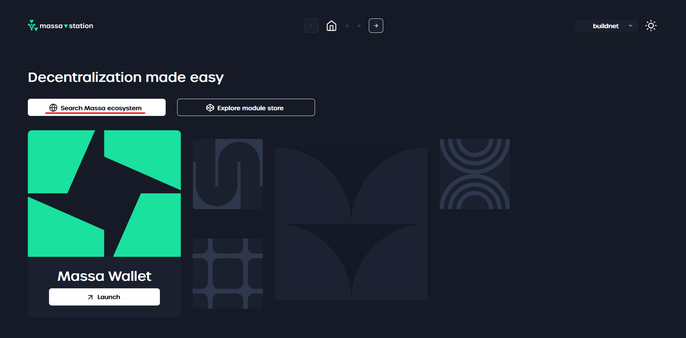
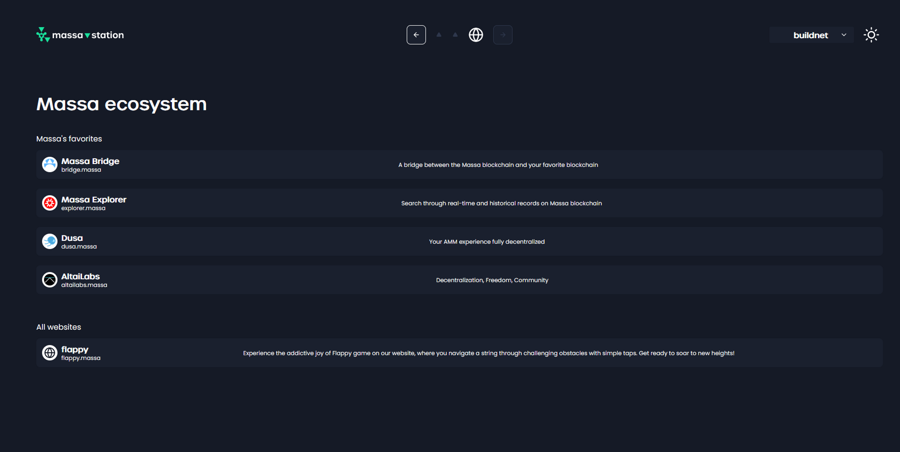

## Browse Decentralized Application

*Massa Station* enables you to browse decentralized applications (dApps) hosted on the blockchain and interact with them.

### Browsing Steps

1. Open *Massa Station*.
2. Click on the **Search Massa ecosystem** button.

3. Search for the website you want to browse.

4. Click on it to open it in your web browser.
