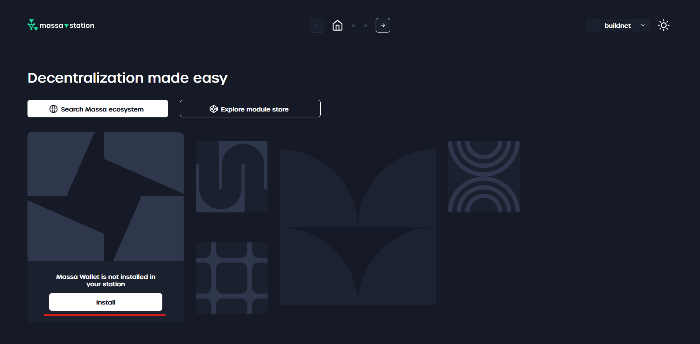
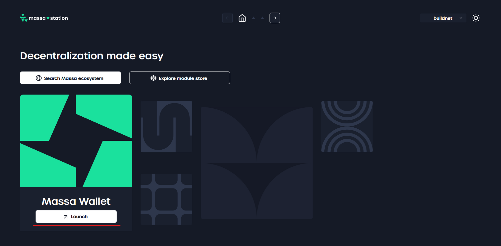

## Massa Wallet

The  *Massa Wallet* module enhances *Massa Station* by adding wallet-related functionalities, such as account management (creation, transfer, balance checking),
and private key management (signing transactions, generating random messages).

### Installation

To install the  *Massa Wallet* module, follow these steps:

1. If *Massa Station* is not running, start it:
  
  - On **Windows**, you can find *Massa Station* in your **Start Menu** and on your **Desktop**.
  - On **MacOS**, you can find *Massa Station* in **LaunchPad** or in the ‘**Applications**’ directory in **Finder**.
  - On **Linux**, you can find *Massa Station* in your **Applications** menu.
  
2. Open *Massa Station* in your web browser. You can do it either by:
  - Clicking on the *Massa Station* icon in the system tray and then clicking on **Open Massa Station**.
  - Opening [https://station.massa/](https://station.massa/) in your web browser.

3. In the  *Massa Wallet* section, click on the ‘**Install**’ button.

  

4. Once the installation is complete, click on the ‘**Launch**’ button to access the  *Massa Wallet* module.

  

:::tip
If you are unable or do not wish to install a thick client, you can always use one of our [community browser extensions](/docs/build/wallet/community-wallets).
However, by doing so, you will limit your access to the full potential of this super app.
:::
